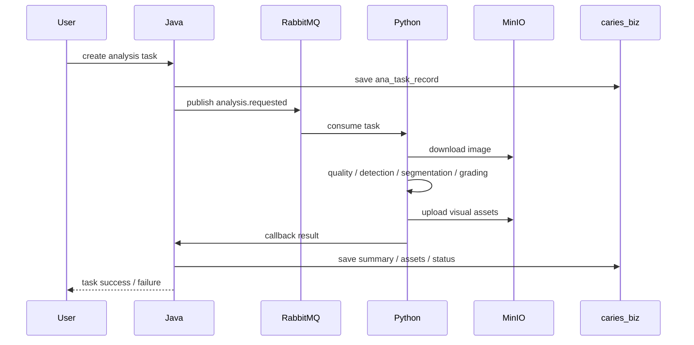
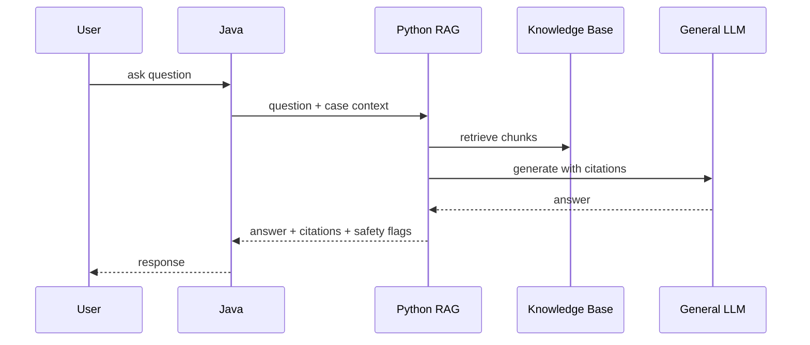
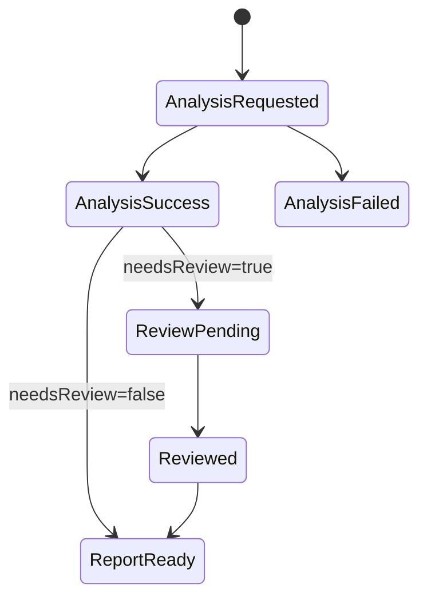
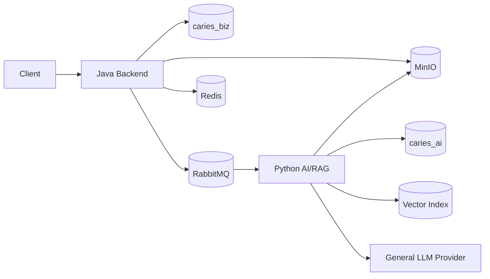
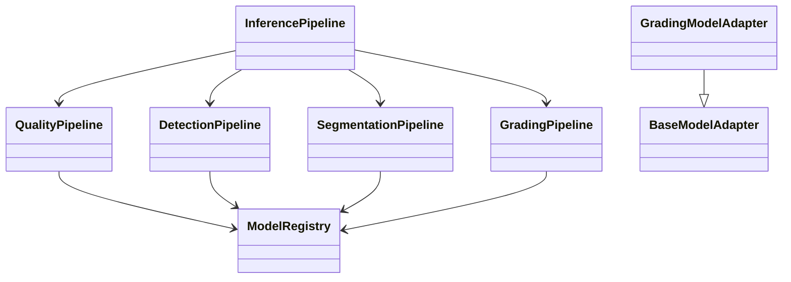

# 01 架构设计

## 1. 产品定位

CariesGuard 是面向口腔龋病筛查、AI 辅助分析、报告生成、复核和随访管理的辅助决策平台。系统强调可追溯、可复核、可解释和可迭代，AI 不替代医生诊断。

AI 路线：

- 通用大模型 + 知识图库检索增强；
- 不采用业务专用大模型微调作为当前主路线；
- 影像质量、检测、分割、分级由可替换的算法适配器输出结构化结果；
- 高 uncertainty 触发复核；
- 所有 AI/RAG 结果留痕可审计；
- `real` 模式失败必须显式失败，不允许静默回退。

## 2. 总体架构

```text
Web / App / Internal Client
  -> Java Backend
      -> caries_biz (MySQL)
      -> Redis
      -> MinIO
      -> RabbitMQ
      -> Python AI/RAG
          -> caries_ai (MySQL)
          -> MinIO
          -> Vector Index
          -> General LLM Provider
```

Java 负责业务主链，Python 负责 AI/RAG 能力。

## 3. 服务分工

Java 后端：

- 用户、组织、权限、审计；
- 患者、就诊、病例、影像、附件；
- analysis task 创建与状态推进；
- callback 签名校验与落库；
- 报告、复核、随访；
- RAG 展示入口（鉴权 + 上下文组装 + 展示）。

Python 后端：

- AI 推理流水线（quality / detection / segmentation / grading / risk）；
- visual asset 生成与上传 MinIO；
- RAG 知识检索与通用大模型调用；
- AI / RAG 运行日志；
- 模型、算法、知识版本治理。

## 4. 核心链路

### 4.1 影像分析链路



### 4.2 RAG 问答链路



### 4.3 Review 状态机



## 5. 组件关系



## 6. AI 模块类图



## 7. 对象存储

MinIO bucket：

| bucket | 用途 |
| --- | --- |
| `caries-image` | 原始影像 |
| `caries-visual` | MASK / OVERLAY / HEATMAP |
| `caries-report` | 报告文件 |
| `caries-export` | 导出文件 |

- Java 是附件主数据权威；
- Python 只生成并回传 visual asset 元数据；
- bucket 默认私有，不开放匿名访问。

## 8. 安全与合规

- 患者敏感信息不得进入 Python 日志与 RAG prompt；
- callback 请求必须签名校验；
- 结果保留审计，医疗结论必须保留医生复核入口；
- RAG 输出不得直接更改病例、报告或复核状态；
- 通用大模型输出仅作辅助说明。

## 9. 阶段状态

已完成：

- Java / Python callback 主链；
- MinIO visual asset 链路；
- Phase 5A quality / detection；
- Phase 5B segmentation；
- Phase 5C grading + uncertainty；
- Docker E2E 验收。

下一阶段：

- Phase 5D 风险融合真实化；
- RAG 知识图库治理与评估闭环；
- 医生复核反馈数据回流；
- 通用大模型安全评估。
