# 多模态龋齿智能识别平台 —— UML 图集

> **文档性质**：软件设计 UML 图集  
> **说明**：本版图集仅保留当前真实落地架构，统一与《项目总体设计文档》的口径，不再以过重的未来分布式方案作为主展示内容。

---

## 目录

1. [设计约束说明](#1-设计约束说明)
2. [用例图](#2-用例图)
3. [组件图](#3-组件图)
4. [核心领域类图](#4-核心领域类图)
5. [时序图](#5-时序图)
6. [状态机图](#6-状态机图)
7. [部署图](#7-部署图)
8. [ER 图](#8-er-图)
9. [活动图](#9-活动图)
10. [图集维护要求](#10-图集维护要求)

---

## 1. 设计约束说明

本图集遵循以下约束：

1. 当前系统架构固定为“**模块化单体 + 独立 AI 服务 + RabbitMQ 解耦**”；
2. 业务运行数据与训练数据分层治理，图中必须体现边界；
3. 候选模型上线需要“**离线评估 + 人工审批**”，不使用“自动切换主模型”的口径；
4. 图中重点体现真实业务闭环，而非未来集群化想象。

---

## 2. 用例图

### 2.1 系统总体用例图

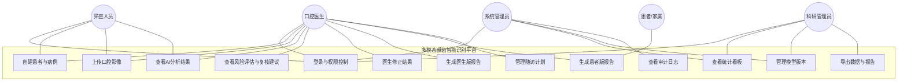

### 2.2 医生端核心闭环用例图

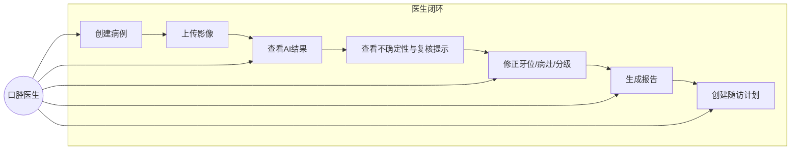

---

## 3. 组件图

### 3.1 平台总体组件图

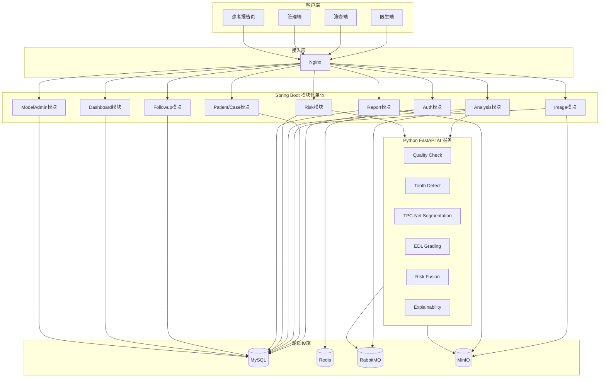

### 3.2 AI 服务组件图

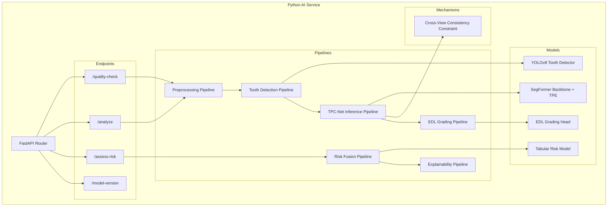

---

## 4. 核心领域类图

### 4.1 业务运行域类图

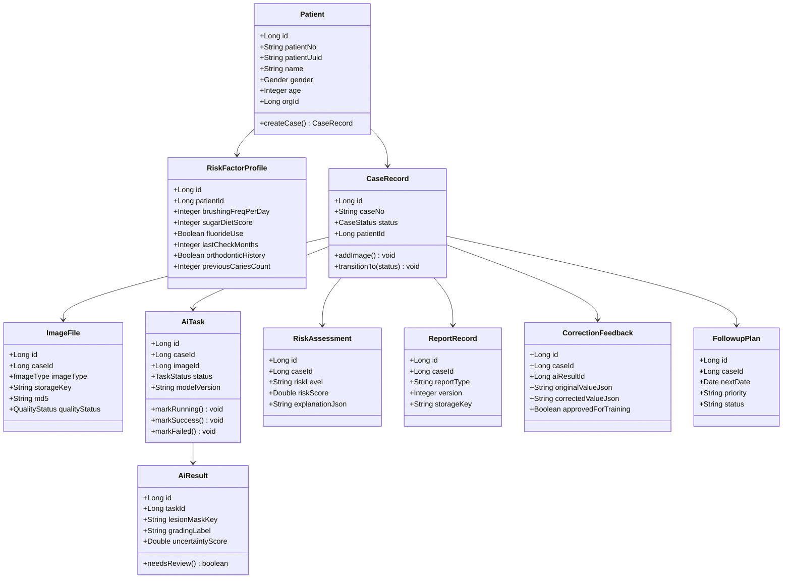

### 4.2 训练数据治理类图

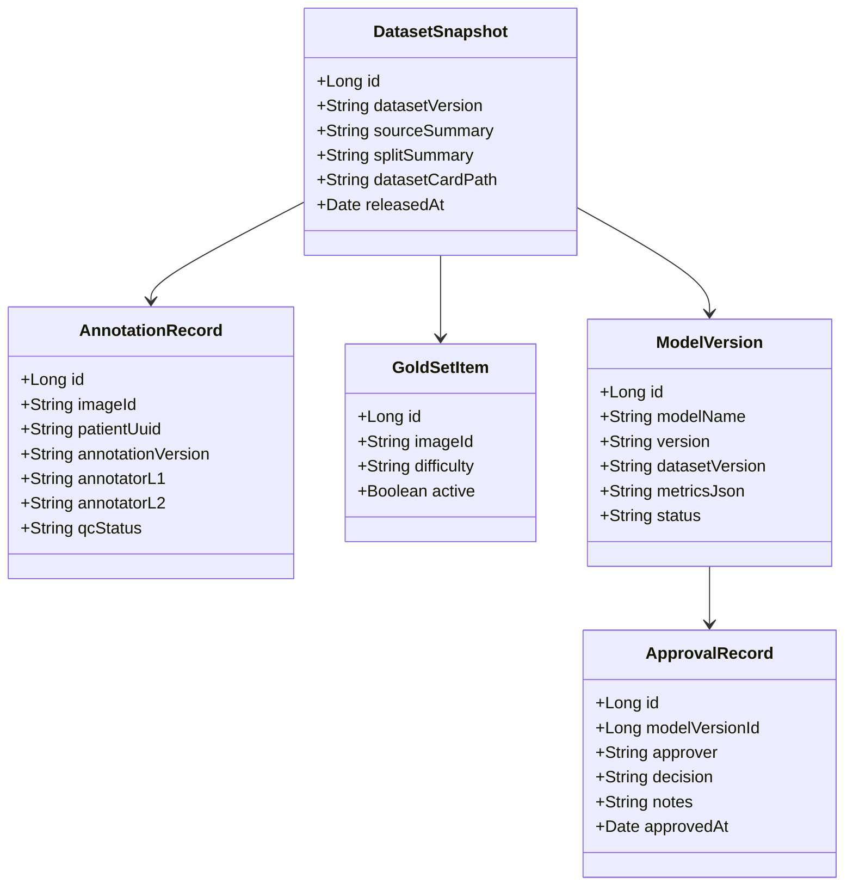

---

## 5. 时序图

### 5.1 影像上传到报告生成时序图

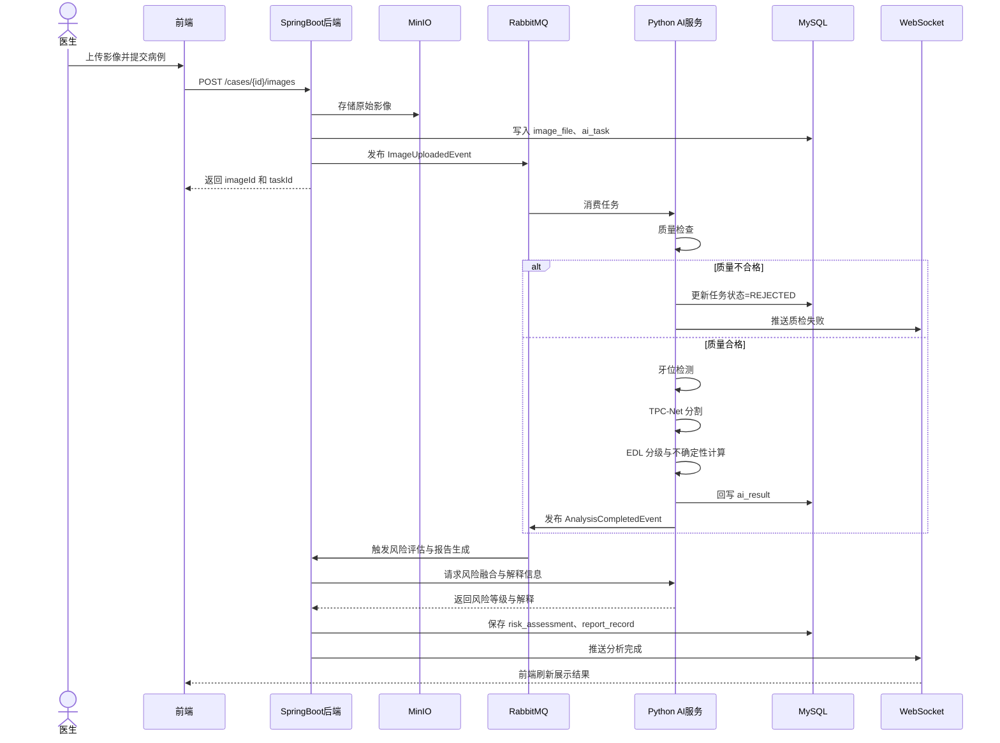

### 5.2 医生修正与回流治理时序图

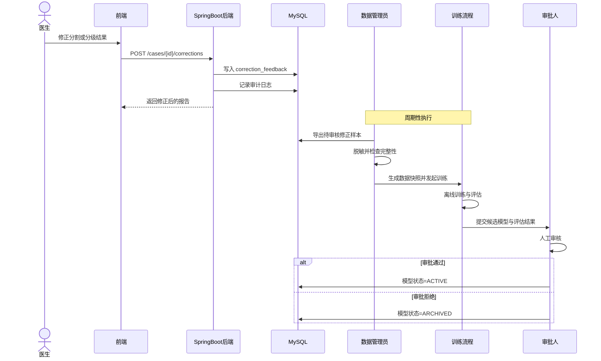

### 5.3 数据边界治理时序图

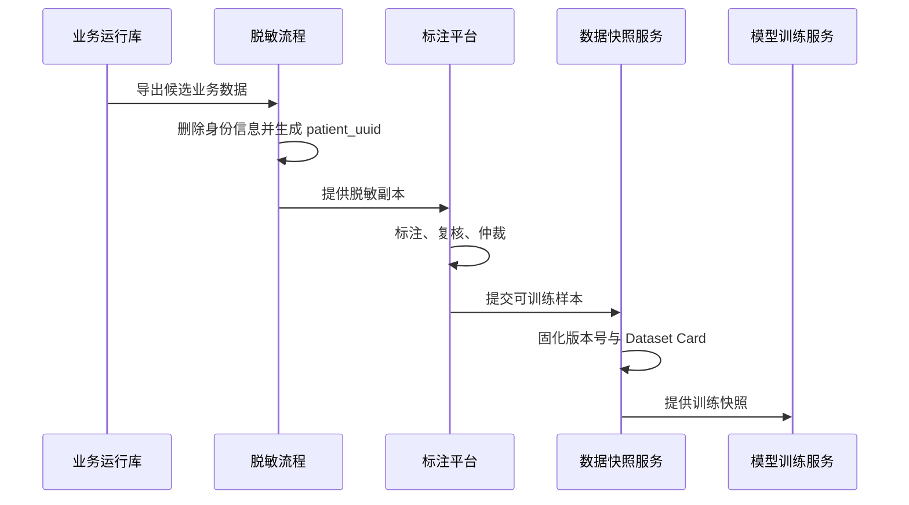

---

## 6. 状态机图

### 6.1 病例状态机

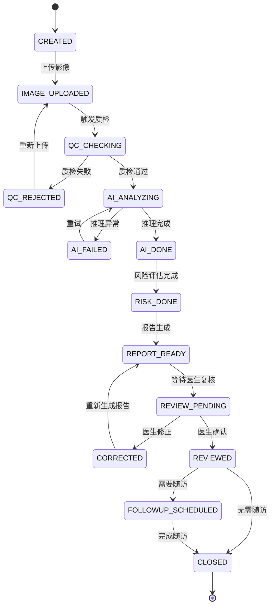

### 6.2 模型版本状态机

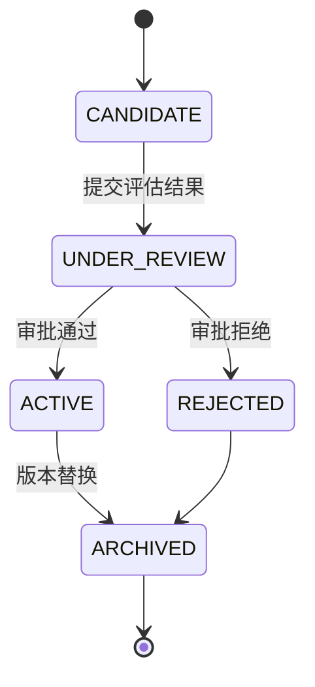

---

## 7. 部署图

### 7.1 当前落地部署图（演示环境）

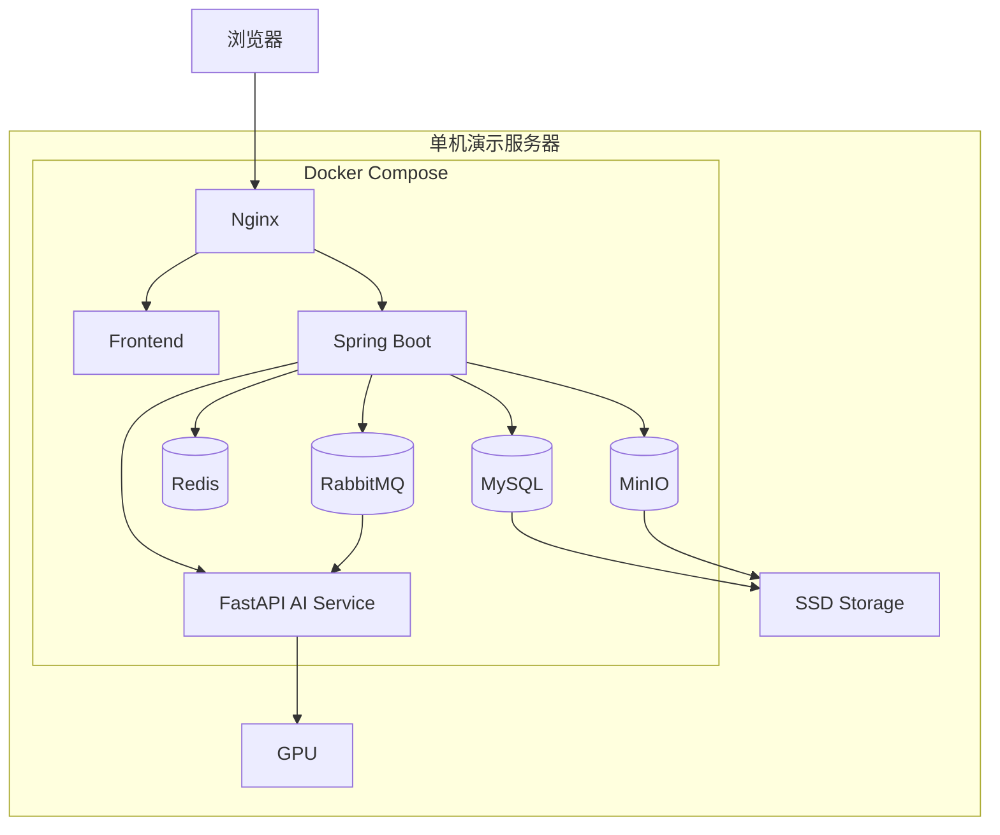

### 7.2 数据边界部署示意图

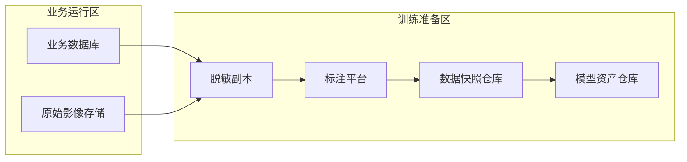

---

## 8. ER 图

### 8.1 业务运行核心 ER 图

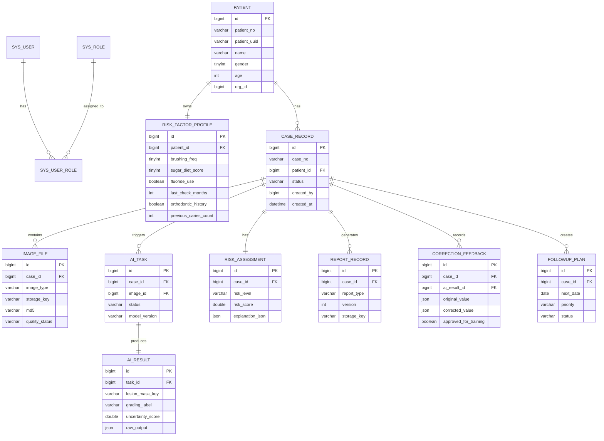

### 8.2 训练治理 ER 图

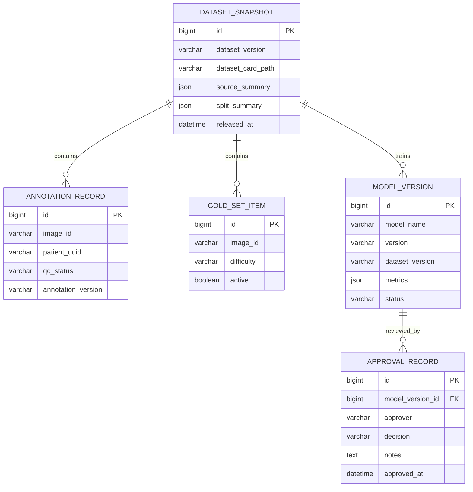

---

## 9. 活动图

### 9.1 基础筛查闭环活动图

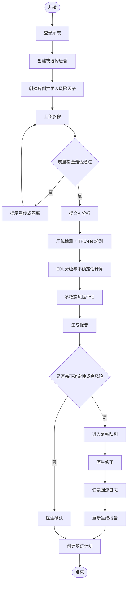

### 9.2 数据回流治理活动图

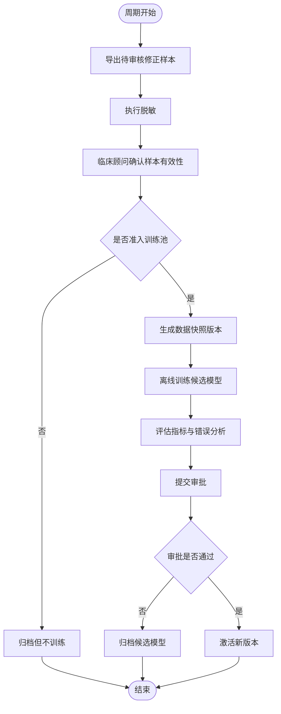

---

## 10. 图集维护要求

1. 本图集必须与《项目总体设计文档》保持一致；
2. 每次状态流、模块边界或数据边界发生变化，都要同步更新；
3. 答辩 PPT 中优先使用：
   - 平台总体组件图；
   - 影像上传到报告生成时序图；
   - 基础筛查闭环活动图；
   - 当前落地部署图；
4. 未来扩展架构可单独附录说明，但不作为当前主图展示；
5. 重要评审节点建议将 Mermaid 图导出为 PNG/SVG 固化版本。
