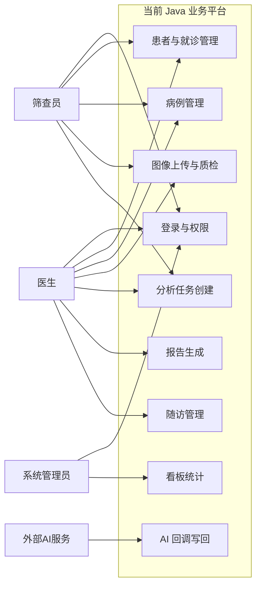
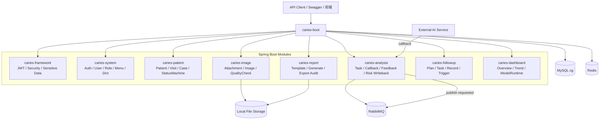
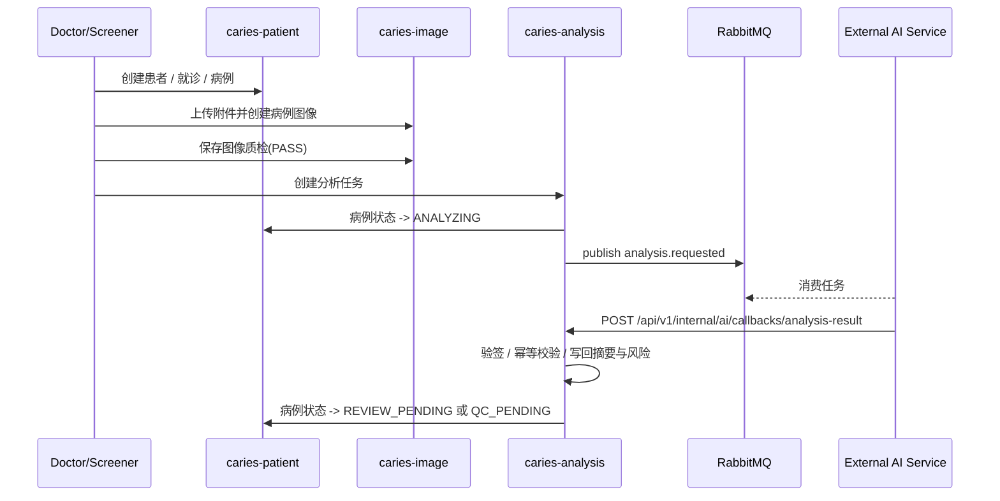
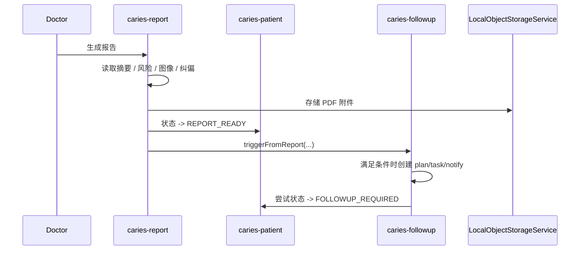
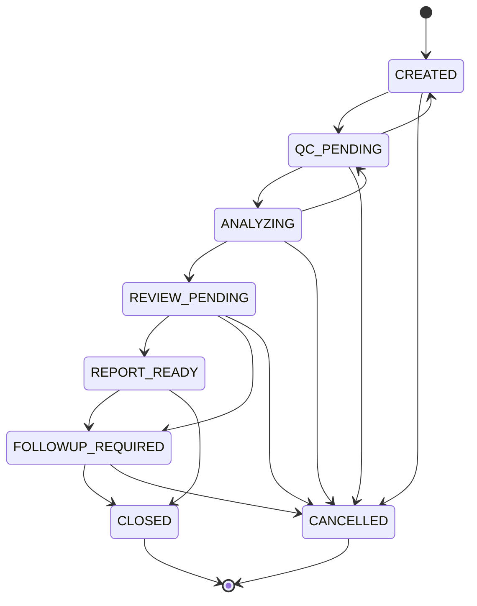
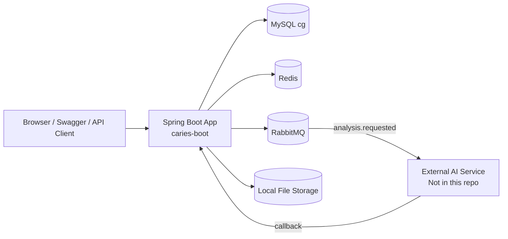
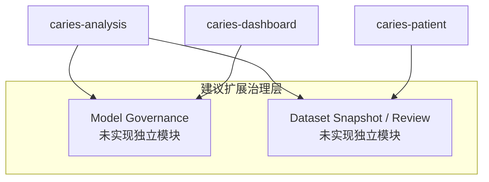

# UML图集

本文档只保留与当前代码一致的 UML 表达，同时把来源设计中的“治理原则”和“未落地能力”单独标注，避免把设计口径写成已实现事实。

## 1. 绘图规则

1. `当前实现` 与 `建议扩展` 分开描述。
2. `Risk` 作为能力存在，不画成当前独立模块。
3. `ModelAdmin` 只保留为治理设计原则，不画成当前独立模块。
4. 部署图优先反映当前真实可确认形态：Java 后端 + MySQL + Redis + RabbitMQ + 本地文件系统。

## 2. 当前用例图

## 3. 当前组件图

说明：
- MinIO 已作为当前对象存储 provider 落地，同时保留 LOCAL_FS 作为本地/E2E provider。
- 来源稿中的独立 Risk / ModelAdmin 不再画成当前实现组件。

## 4. 当前主链路时序图

### 4.1 病例创建到分析回调

### 4.2 报告与随访链路

## 5. 病例状态机图

## 6. 当前部署图

当前部署结论：
- 可以确认 Java 后端本地 profile 的依赖和运行方式。
- 不能把完整 Frontend / Python AI Service / Docker Compose 写成当前已交付事实；MinIO 对象存储 provider 已在 Java 后端落地。

## 7. 来源设计中保留但不画成当前实现的能力

### 7.1 模型治理能力

来源中的正确原则：
- 候选模型
- 离线评估
- 专家复核
- 人工审批上线
- 模型资产分层治理

当前 UML 处理方式：
- 不画成 `ModelAdmin` 独立模块
- 在文档说明里保留为“建议扩展治理能力”

### 7.2 风险评估能力

当前 UML 处理方式：
- 风险评估作为 `caries-analysis` 写回能力和 `caries-dashboard` 统计能力存在
- 不单独拆成 `Risk` 模块

## 8. 建议扩展图（不代表当前已实现）

说明：
- 这张图只表达“应保留的治理方向”。
- 不可在答辩或现状描述中说它已经完成开发。

