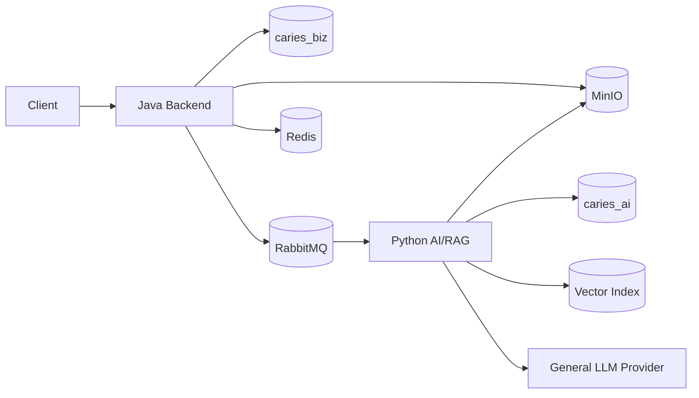
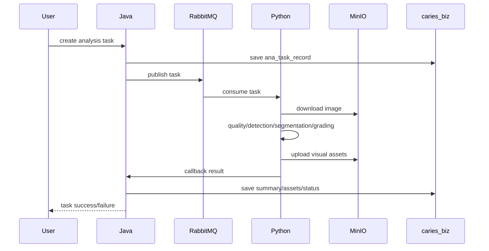
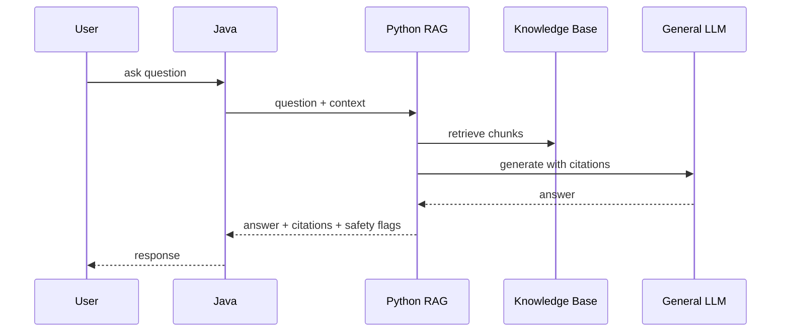
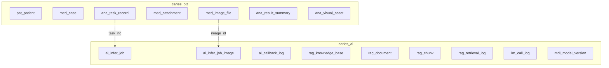
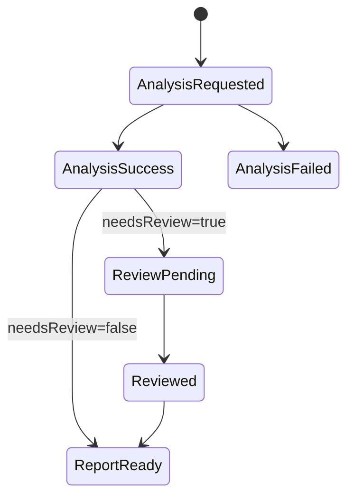
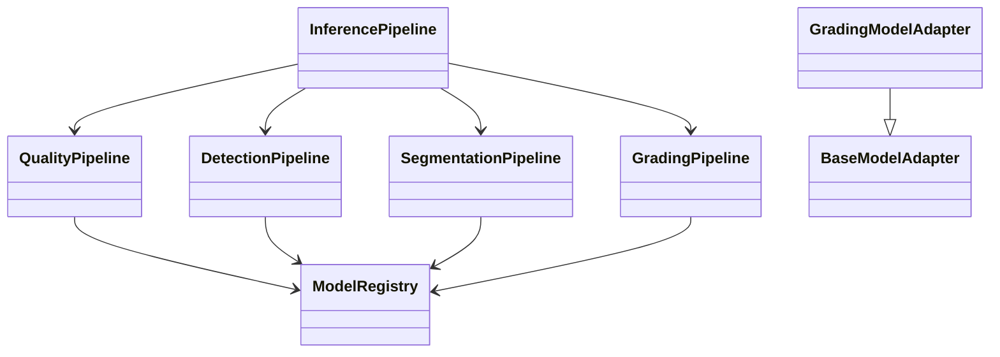

# 02 UML 图集

## 1. 组件图

```mermaid
flowchart LR
  Client[Client] --> Java[Java Backend]
  Java --> BizDB[(caries_biz)]
  Java --> MinIO[(MinIO)]
  Java --> MQ[(RabbitMQ)]
  Java --> Redis[(Redis)]
  MQ --> Python[Python AI/RAG]
  Python --> AiDB[(caries_ai)]
  Python --> MinIO
  Python --> Vector[(Vector Index)]
  Python --> LLM[General LLM Provider]
```

## 2. Analysis 时序图

```mermaid
sequenceDiagram
  participant U as User
  participant J as Java
  participant Q as RabbitMQ
  participant P as Python
  participant M as MinIO
  participant DB as caries_biz

  U->>J: create analysis task
  J->>DB: save ana_task_record
  J->>Q: publish task
  Q->>P: consume task
  P->>M: download image
  P->>P: quality/detection/segmentation/grading
  P->>M: upload visual assets
  P->>J: callback result
  J->>DB: save summary/assets/status
  J-->>U: task success/failure
```

## 3. RAG 时序图

```mermaid
sequenceDiagram
  participant U as User
  participant J as Java
  participant P as Python RAG
  participant K as Knowledge Base
  participant L as General LLM

  U->>J: ask question
  J->>P: question + context
  P->>K: retrieve chunks
  P->>L: generate with citations
  L-->>P: answer
  P-->>J: answer + citations + safety flags
  J-->>U: response
```

## 4. 数据归属图

```mermaid
flowchart TB
  subgraph JavaDB[caries_biz]
    Patient[pat_patient]
    Case[med_case]
    Image[med_image_file]
    Attachment[med_attachment]
    Task[ana_task_record]
    Summary[ana_result_summary]
    Asset[ana_visual_asset]
  end

  subgraph PythonDB[caries_ai]
    Job[ai_infer_job]
    JobImage[ai_infer_job_image]
    Callback[ai_callback_log]
    KB[rag_knowledge_base]
    Doc[rag_document]
    Chunk[rag_chunk]
    Retrieval[rag_retrieval_log]
    LlmLog[llm_call_log]
    Model[mdl_model_version]
  end

  Task -. task_no .-> Job
  Image -. image_id .-> JobImage
```

## 5. Review 状态图

```mermaid
stateDiagram-v2
  [*] --> AnalysisRequested
  AnalysisRequested --> AnalysisSuccess
  AnalysisRequested --> AnalysisFailed
  AnalysisSuccess --> ReviewPending: needsReview=true
  AnalysisSuccess --> ReportReady: needsReview=false
  ReviewPending --> Reviewed
  Reviewed --> ReportReady
```

## 6. AI 模块类图

```mermaid
classDiagram
  class InferencePipeline
  class QualityPipeline
  class DetectionPipeline
  class SegmentationPipeline
  class GradingPipeline
  class ModelRegistry
  class BaseModelAdapter
  class GradingModelAdapter

  InferencePipeline --> QualityPipeline
  InferencePipeline --> DetectionPipeline
  InferencePipeline --> SegmentationPipeline
  InferencePipeline --> GradingPipeline
  QualityPipeline --> ModelRegistry
  DetectionPipeline --> ModelRegistry
  SegmentationPipeline --> ModelRegistry
  GradingPipeline --> ModelRegistry
  GradingModelAdapter --|> BaseModelAdapter
```
