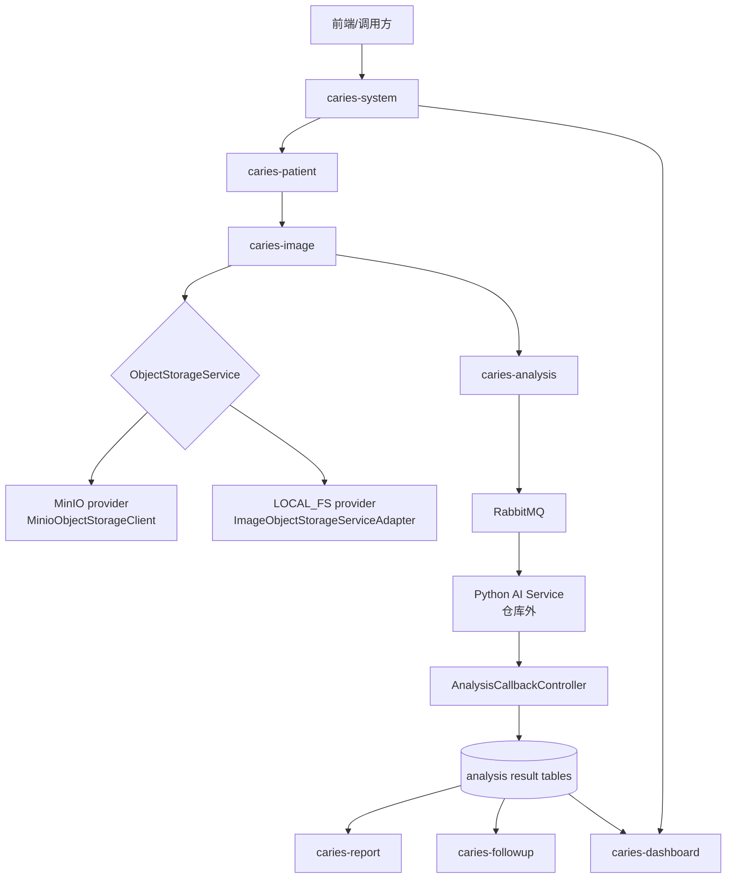
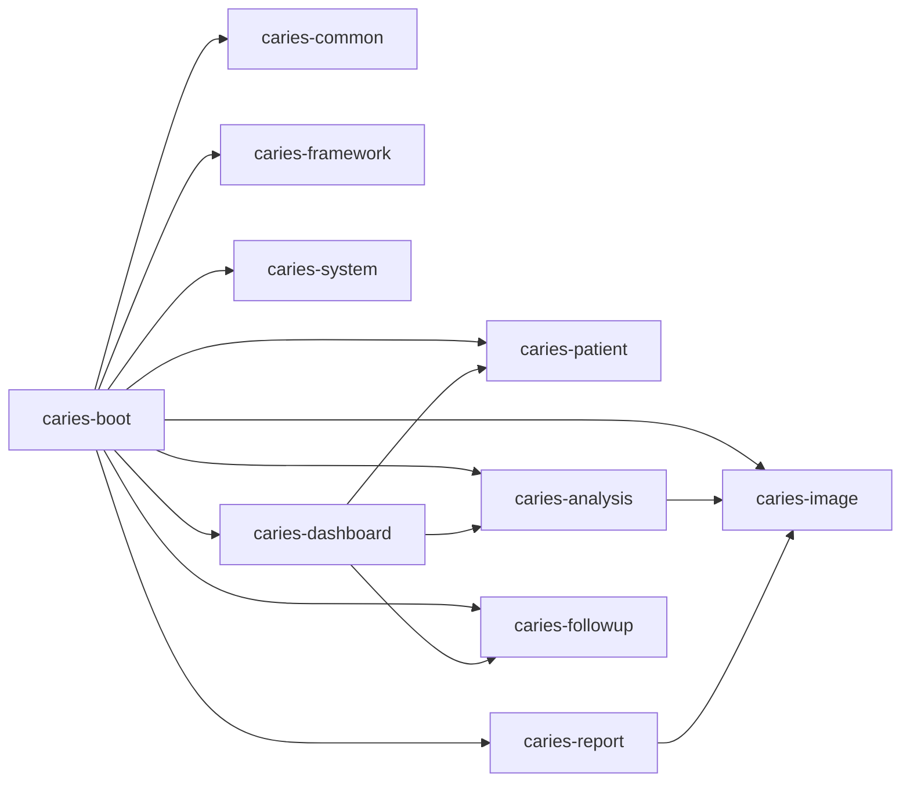
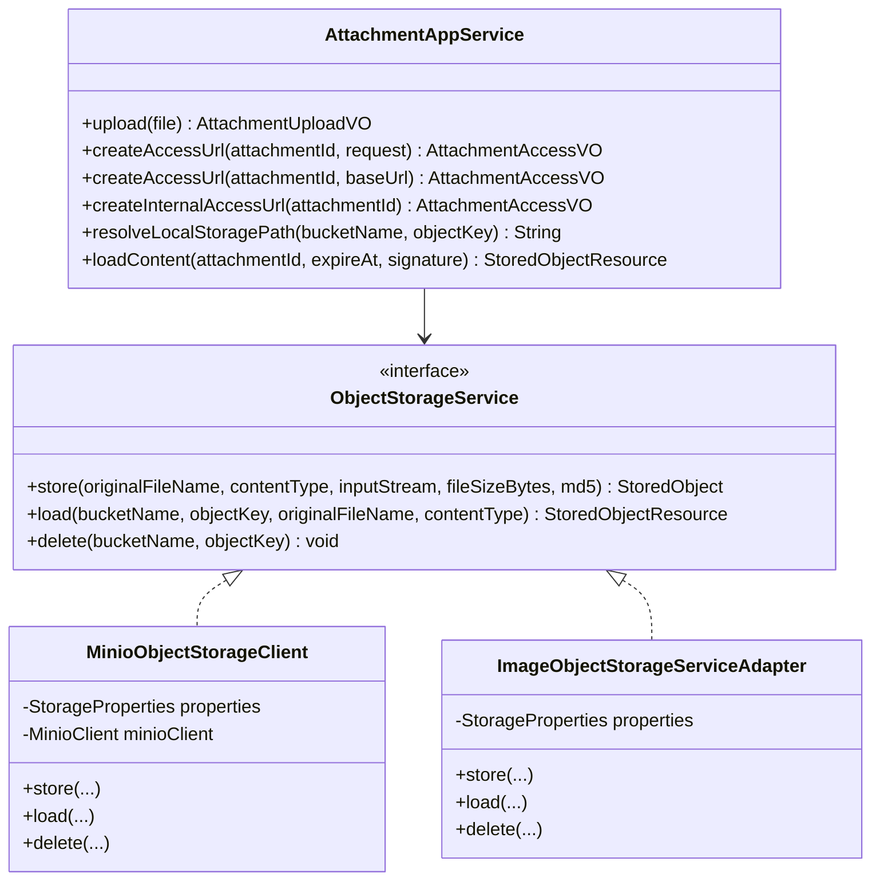
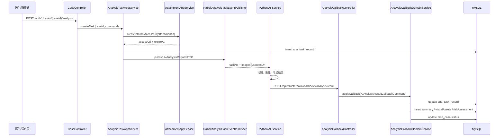
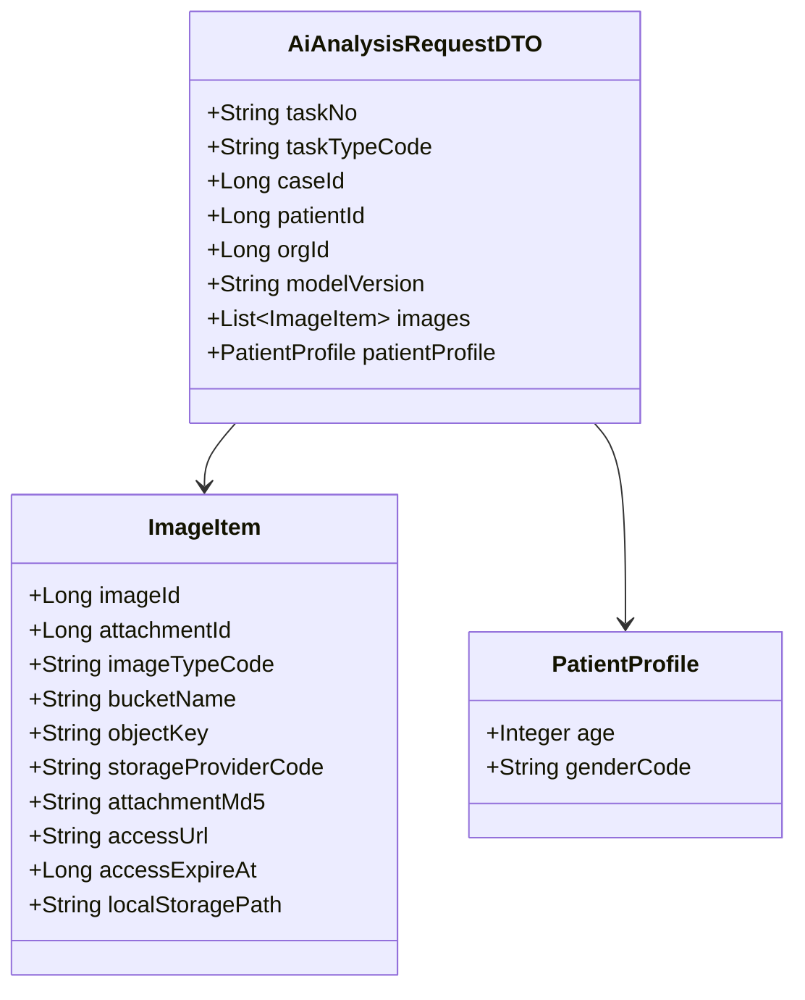
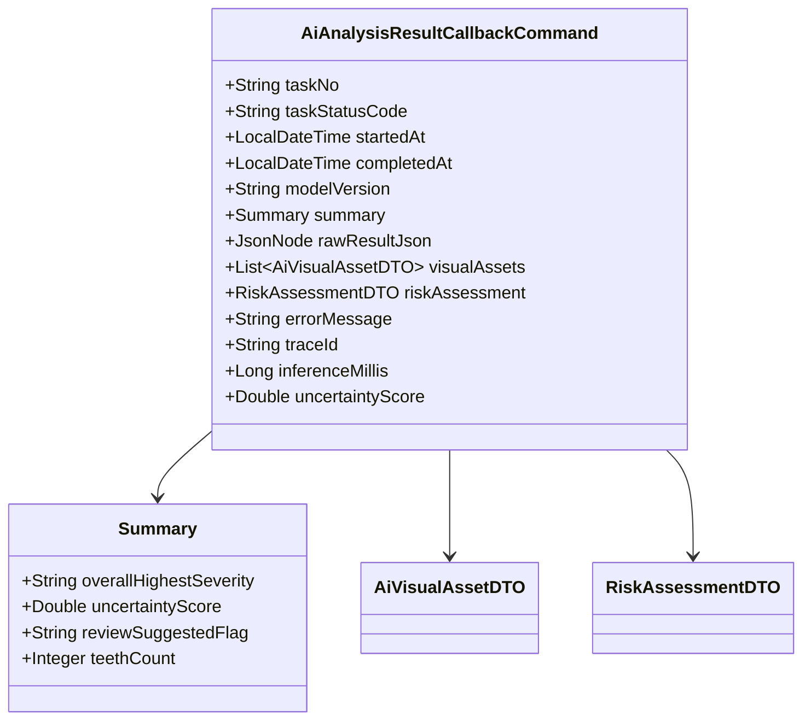
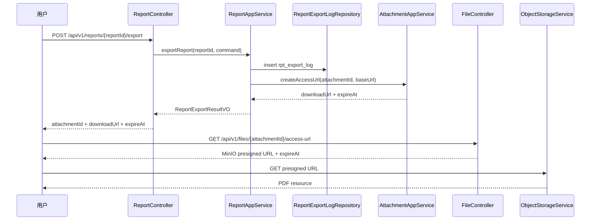
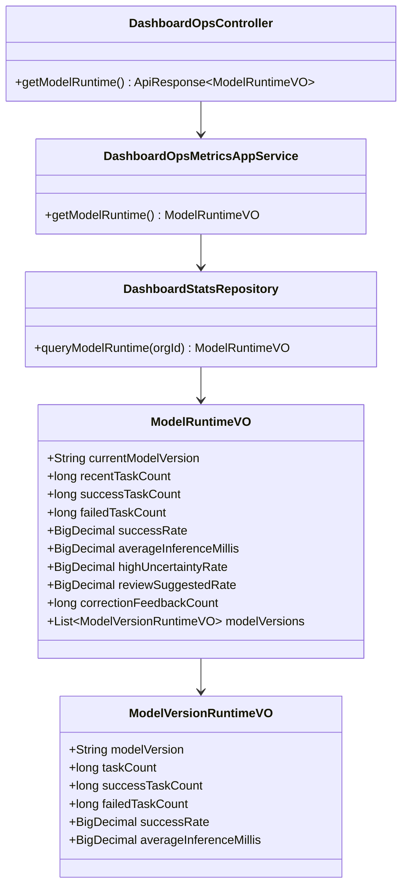
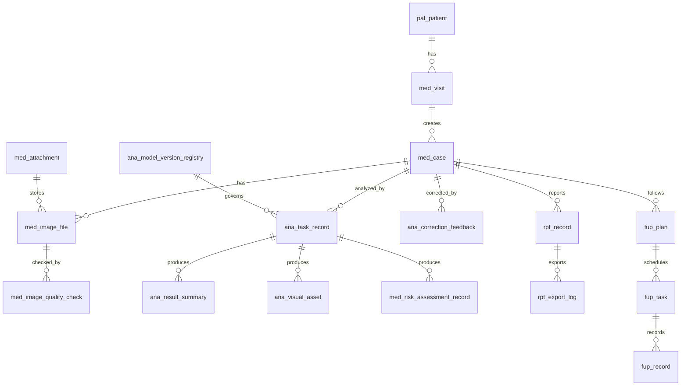
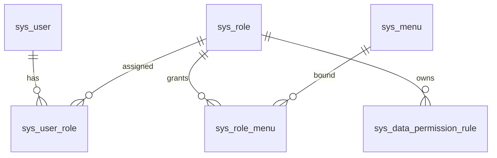

# UML图集

更新日期：2026-04-15

本文档用 UML / Mermaid 图描述当前代码结构。图中不会把未落地的 `Risk`、`ModelAdmin` 画成独立模块；它们只作为能力或治理边界出现。

## 1. 系统组件图

## 2. 模块依赖图

## 3. 对象存储类图

## 4. AI 分析任务时序图

## 5. AI 请求载荷结构图

## 6. AI 回调载荷结构图

## 7. 报告导出时序图

## 8. 看板模型运行统计类图

## 9. 数据库领域图

## 10. 权限模型图

当前 V014 已初始化：

1. `ORG_ADMIN`
2. `DOCTOR`
3. `SCREENER`
4. 患者、就诊、病例、影像、分析、报告、随访、看板菜单
5. `dashboard:ops:view` AI 运行看板权限
6. 数据权限规则和列脱敏策略种子
