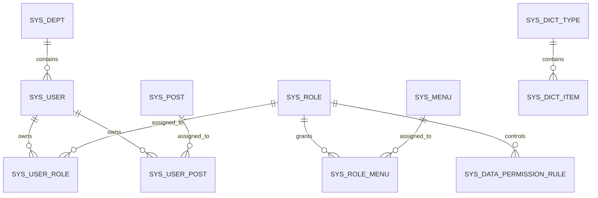
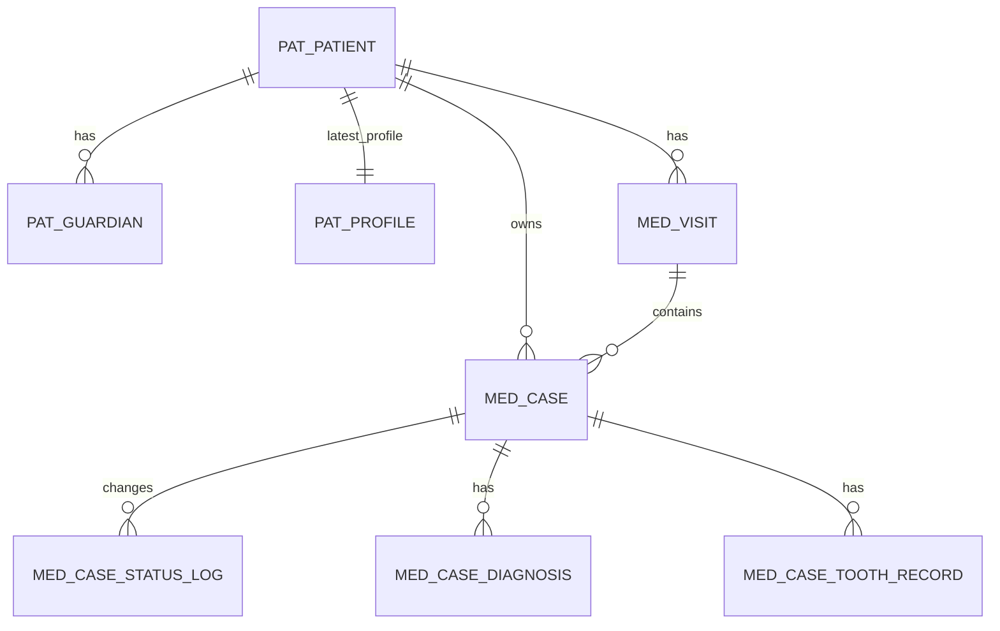
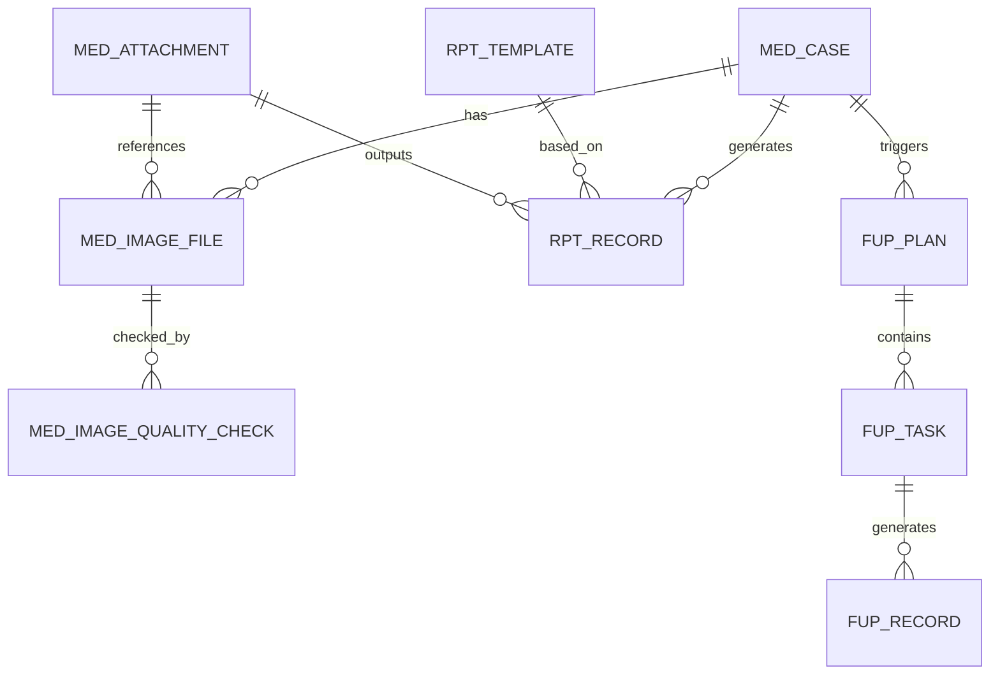
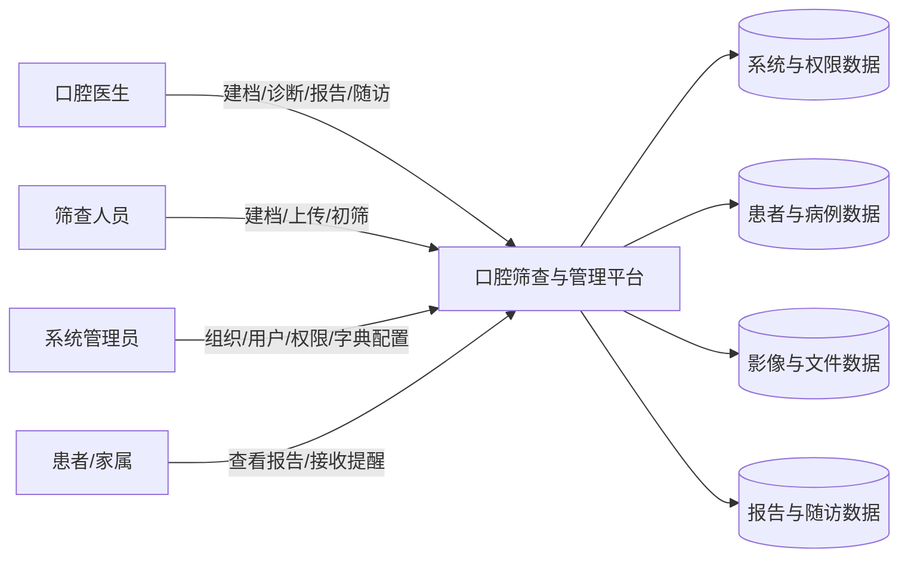
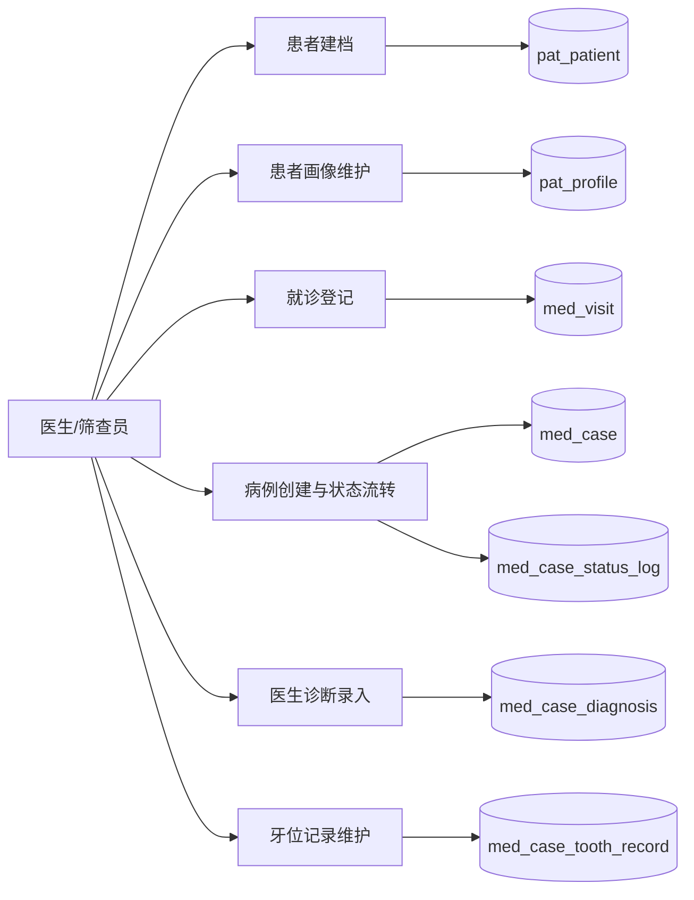
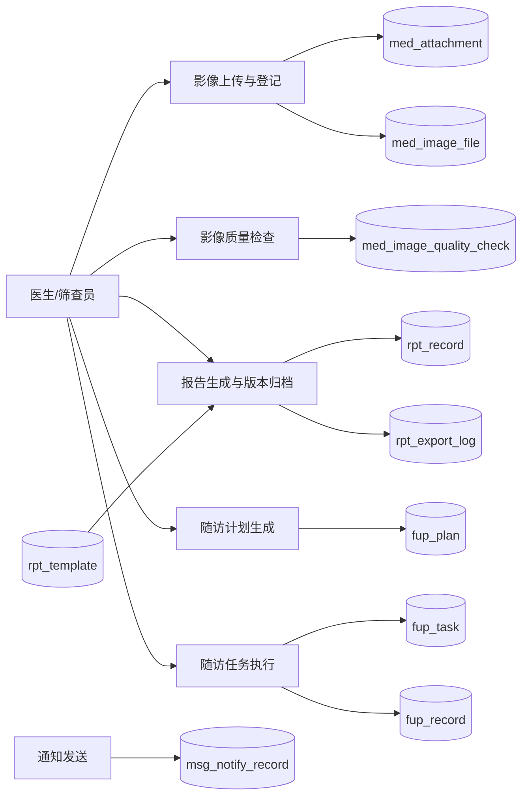
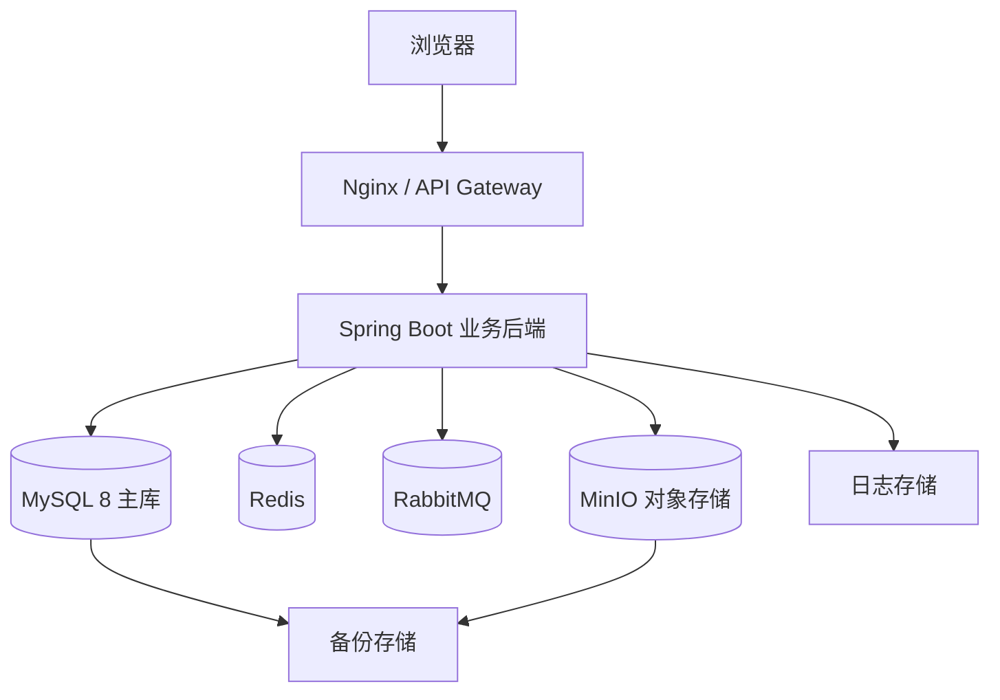
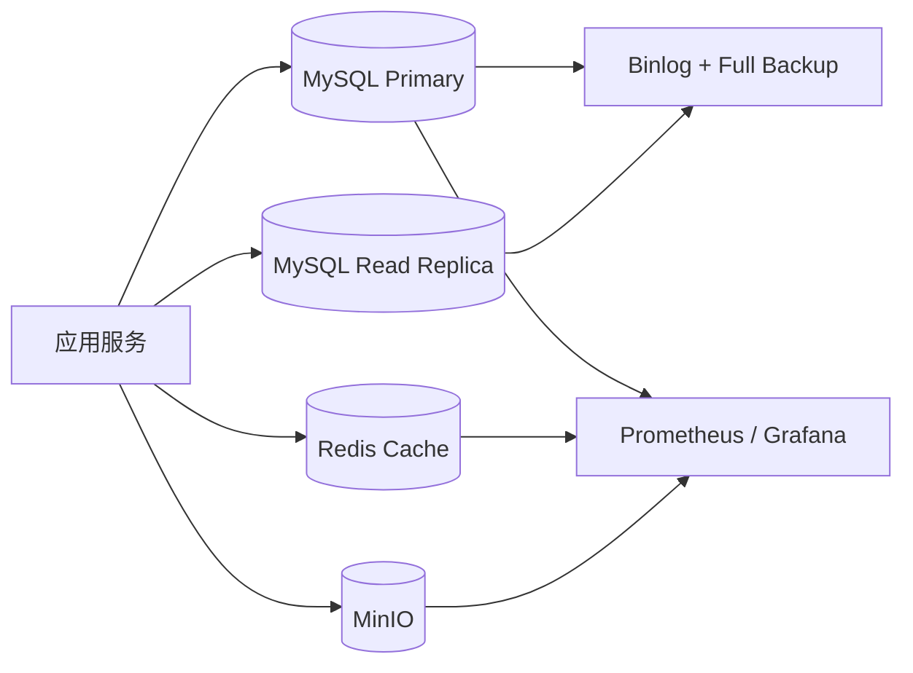

# 多模态龋齿智能识别与分级预警平台 —— 数据库总体设计与数据治理文档

> 文档性质：数据库顶层设计文档  
> 适用范围：Java 业务后端、数据库设计、数据治理、权限设计、部署规划  
> 当前版本：v1.0  
> 设计边界：**本文仅覆盖业务平台数据库与数据治理体系**

---

## 目录

1. [文档目标与设计边界](#1-文档目标与设计边界)
2. [数据库设计总原则](#2-数据库设计总原则)
3. [业务范围与数据域划分](#3-业务范围与数据域划分)
4. [概念数据模型](#4-概念数据模型)
5. [实体关系图（ER 图）](#5-实体关系图er-图)
6. [逻辑数据模型说明](#6-逻辑数据模型说明)
7. [数据流图（DFD）](#7-数据流图dfd)
8. [数据库命名规范](#8-数据库命名规范)
9. [数据标准与代码集](#9-数据标准与代码集)
10. [数据隐私与分级分类清单](#10-数据隐私与分级分类清单)
11. [数据权限矩阵](#11-数据权限矩阵)
12. [数据质量控制要求](#12-数据质量控制要求)
13. [数据生命周期与留存策略](#13-数据生命周期与留存策略)
14. [数据库部署与架构拓扑图](#14-数据库部署与架构拓扑图)
15. [实施建议与落地顺序](#15-实施建议与落地顺序)

---

## 1. 文档目标与设计边界

本文件的目标不是给出 SQL，而是先把**数据库前置设计资产**做完整，使后续开发具备统一依据：

- 先定义**业务实体**；
- 再定义**实体之间的关系**；
- 再定义**字段、代码集、权限、隐私分级、部署架构**；
- 最后再进入建表与编码阶段。

### 1.1 本文档交付物

本文档覆盖以下内容：

- 业务侧数据库概念模型；
- 业务侧数据库逻辑模型；
- ER 图；
- 数据流图；
- 数据字典编制标准；
- 数据库命名规范；
- 数据标准与代码集；
- 数据隐私与分级分类清单；
- 数据权限矩阵；
- 数据库部署与拓扑设计。

### 1.2 本文档明确不覆盖的内容

以下内容不在本文件范围内：

- AI 训练集结构；
- AI 推理任务表；
- 模型版本表；
- 标注数据表；
- 模型输出结果表；
- 训练治理表。

### 1.3 与现有项目主文档的关系

本数据库设计文档遵循你当前已有文档中的统一口径：

- 架构仍然是 **模块化单体 + 独立 AI 服务预留 + RabbitMQ 解耦**；
- 平台定位仍然是 **真实筛查流程辅助决策平台**；
- 数据治理仍然坚持 **业务数据与训练数据边界清晰**。

---

## 2. 数据库设计总原则

### 2.1 核心原则

1. **业务先于技术**：数据库先服务真实业务闭环，而不是为炫技而复杂化。
2. **主数据清晰**：患者、就诊、病例、影像、报告、随访是主线，不能混乱。
3. **最小必要采集**：只采与当前业务直接相关的数据，不采与目标弱相关的敏感字段。
4. **统一代码集**：状态、类型、枚举一律统一走字典体系。
5. **高敏字段保护**：身份信息、联系方式、病例内容、报告内容必须纳入高敏分级。
6. **行级权限优先设计**：数据库模型必须天然支持机构隔离、医生本人、部门范围等数据权限。
7. **审计可追溯**：关键业务动作、状态流转、导出分享、通知发送都必须可追踪。
8. **先逻辑模型，后物理优化**：先把实体关系和字段讲清楚，再做索引、分区、冷热分层。

### 2.2 数据建模层次

本项目数据库模型分三层：

| 层次 | 目标 | 本次是否覆盖 |
|---|---|---|
| 概念数据模型 | 定义系统有哪些核心实体、它们如何关联 | 是 |
| 逻辑数据模型 | 定义表、字段、主外键、代码集、约束 | 是 |
| 物理数据模型 | 定义 MySQL 实际建表、索引、分区、字符集、参数 | 部分覆盖，暂不写 SQL |

---

## 3. 业务范围与数据域划分

### 3.1 数据域总览

为了避免后续数据库混乱，本项目建议按以下 6 个数据域组织：

| 数据域 | 说明 | 代表对象 |
|---|---|---|
| 系统管理域 | 账号、角色、菜单、部门、岗位、字典、配置 | sys_user、sys_role、sys_dict_type |
| 权限与审计域 | 数据权限规则、操作日志、登录日志 | sys_data_permission_rule、sys_oper_log |
| 患者与病例域 | 患者档案、画像、就诊、病例、诊断、牙位记录 | pat_patient、med_visit、med_case |
| 影像与文件域 | 影像记录、附件元数据、质量检查 | med_attachment、med_image_file |
| 报告与随访域 | 报告模板、报告记录、随访计划、随访任务与记录 | rpt_record、fup_plan、fup_task |
| 消息与提醒域 | 通知发送记录、提醒留痕 | msg_notify_record |

### 3.2 全表总览

| 数据域 | 表名 | 中文名 | 作用 |
|---|---|---|---|
| 系统管理域 | `sys_user` | 系统用户表 | 存储平台登录账号、人员身份、联系方式、账号状态，是统一认证与授权的核心主体表。 |
| 系统管理域 | `sys_role` | 系统角色表 | 定义角色、角色排序及数据权限范围，是 RBAC 的基础表。 |
| 系统管理域 | `sys_menu` | 系统菜单权限表 | 维护菜单、按钮、接口权限编码及前端路由信息。 |
| 系统管理域 | `sys_dept` | 组织/部门表 | 维护平台机构、院区、科室、项目组等组织树，用于数据归属与权限控制。 |
| 系统管理域 | `sys_post` | 岗位表 | 维护医生、筛查员、管理员等岗位信息，便于组织管理与数据筛选。 |
| 系统管理域 | `sys_user_role` | 用户角色关联表 | 建立用户与角色的多对多关系。 |
| 系统管理域 | `sys_user_post` | 用户岗位关联表 | 建立用户与岗位的多对多关系。 |
| 系统管理域 | `sys_role_menu` | 角色菜单关联表 | 建立角色与菜单/按钮权限的多对多关系。 |
| 系统管理域 | `sys_dict_type` | 字典类型表 | 维护代码集类型，是平台所有枚举、状态、类型字段的统一来源。 |
| 系统管理域 | `sys_dict_item` | 字典项表 | 维护具体代码项、显示值、排序、标签样式等。 |
| 系统管理域 | `sys_config` | 系统参数配置表 | 存储全局开关、报表参数、文件大小限制、密码策略等配置。 |
| 审计与运维域 | `sys_oper_log` | 操作日志表 | 记录关键业务操作，用于审计追踪、问题排查与责任界定。 |
| 审计与运维域 | `sys_login_log` | 登录日志表 | 记录登录成功、失败、退出、锁定等行为，用于安全审计。 |
| 系统管理域 | `sys_data_permission_rule` | 数据权限规则表 | 维护角色级、模块级的数据范围规则，支撑行级过滤与列级脱敏。 |
| 患者与病例域 | `pat_patient` | 患者主档表 | 存储患者基础身份信息，是所有就诊、病例、影像、报告、随访的主实体。 |
| 患者与病例域 | `pat_guardian` | 监护人信息表 | 用于未成年患者或需代理联系患者的监护人、家属信息管理。 |
| 患者与病例域 | `pat_profile` | 患者扩展画像表 | 存储与口腔筛查、风险评估、健康管理相关的结构化背景信息。 |
| 患者与病例域 | `med_visit` | 就诊记录表 | 记录一次挂号、筛查、复诊、回访到院等就诊事件，是病例的上层业务容器。 |
| 患者与病例域 | `med_case` | 病例主表 | 管理一次业务病例的主状态、主诉、责任医生、是否需随访等核心信息。 |
| 患者与病例域 | `med_case_status_log` | 病例状态流转日志表 | 记录病例状态的每一次变更过程，形成可审计的状态机链路。 |
| 患者与病例域 | `med_case_diagnosis` | 病例诊断结论表 | 存储医生确认后的诊断结论、严重程度和处理建议，是报告生成的直接来源之一。 |
| 患者与病例域 | `med_case_tooth_record` | 病例牙位记录表 | 按牙位、牙面记录病变发现、严重程度和建议，用于结构化报告与后续统计。 |
| 影像与文件域 | `med_attachment` | 附件对象表 | 统一管理上传或生成的文件对象，包括原始影像、报告PDF、导出文件等。 |
| 影像与文件域 | `med_image_file` | 病例影像表 | 管理与病例关联的影像业务记录，包括影像类型、来源、主图标识和质量状态。 |
| 影像与文件域 | `med_image_quality_check` | 影像质量检查表 | 记录对病例影像进行的质量检查结果，既支持人工质检，也支持规则引擎质检。 |
| 报告与随访域 | `rpt_template` | 报告模板表 | 管理医生版、患者版等报告模板及版本，是报告生成的模板基础。 |
| 报告与随访域 | `rpt_record` | 报告记录表 | 存储已生成报告的主信息、版本、模板来源、签发状态和附件引用。 |
| 报告与随访域 | `rpt_export_log` | 报告导出日志表 | 记录报告导出、打印、分享、下载等动作，满足审计与统计要求。 |
| 报告与随访域 | `fup_plan` | 随访计划表 | 记录病例后续复查与跟踪计划，是随访任务的计划层实体。 |
| 报告与随访域 | `fup_task` | 随访任务表 | 将随访计划拆解为执行任务，支持分配、催办、逾期、关闭等管理。 |
| 报告与随访域 | `fup_record` | 随访记录表 | 记录实际随访过程、结果、患者反馈及下一步动作。 |
| 消息与审计域 | `msg_notify_record` | 通知发送记录表 | 记录短信、站内信、邮件等通知行为，支撑提醒、失败重试与消息审计。 |

---

## 4. 概念数据模型

### 4.1 核心业务主线

用业务语言描述，当前平台的数据主线是：

**患者 → 就诊 → 病例 → 影像 / 诊断 / 报告 → 随访计划 → 随访任务 → 随访记录**

### 4.2 关键关系说明

#### 患者与就诊

- 一个患者可以有多次就诊；
- 一次就诊只属于一个患者；
- 就诊是病例的上位业务容器。

#### 就诊与病例

- 一次就诊可以产生一个或多个病例；
- 一个病例只能属于一次就诊；
- 病例是业务处理的中心实体。

#### 病例与影像

- 一个病例可以关联多张影像；
- 一张影像只属于一个病例；
- 影像的对象存储元数据独立于影像业务记录。

#### 病例与诊断

- 一个病例可以有多条诊断记录；
- 一个病例可以按牙位拆分为多条牙位记录；
- 报告生成建议以“病例诊断 + 牙位记录”为直接输入。

#### 病例与报告

- 一个病例可以生成多个版本的报告；
- 报告区分医生版、患者版；
- 最终版报告不可覆盖，只能新增版本。

#### 病例与随访

- 一个病例可生成一个或多个随访计划；
- 一个随访计划可拆分为多个执行任务；
- 一个任务可对应多条实际随访记录。

### 4.3 系统域关系说明

- 用户与角色是多对多；
- 用户与岗位是多对多；
- 角色与菜单是多对多；
- 用户归属于组织/部门树；
- 数据权限规则以角色为主体，对模块定义范围。

---

## 5. 实体关系图（ER 图）

### 5.1 系统管理与权限域 ER 图

### 5.2 患者、就诊、病例主线 ER 图

### 5.3 影像、报告、随访主线 ER 图

### 5.4 实体关系图语言版总结

用一句话概括整个数据库关系：

> `sys_user / sys_role / sys_dept` 负责系统身份与数据边界，`pat_patient / med_visit / med_case` 负责业务主线，`med_attachment / med_image_file / rpt_record / fup_plan` 负责影像、报告与随访闭环。

---

## 6. 逻辑数据模型说明

### 6.1 命名分域

建议统一使用单库多前缀方案，理由是当前架构仍然是**模块化单体**，单库便于研发和演示。

| 前缀 | 数据域 | 说明 |
|---|---|---|
| sys_ | 系统管理 | 用户、角色、菜单、组织、字典、配置 |
| pat_ | 患者主数据 | 患者主档、监护人、画像 |
| med_ | 医疗业务 | 就诊、病例、诊断、牙位记录、影像 |
| rpt_ | 报告 | 模板、报告记录、导出日志 |
| fup_ | 随访 | 计划、任务、记录 |
| msg_ | 消息 | 通知记录 |

### 6.2 主键策略

建议：

- 所有业务表统一使用 `BIGINT` 主键；
- 主键字段统一命名为 `id`；
- 对外展示、业务引用使用 `*_no` 或 `*_code` 字段，不直接暴露主键。

### 6.3 公共审计字段

除纯关联表和纯日志表外，业务表建议统一包含以下公共字段：

- `org_id`
- `status`
- `deleted_flag`
- `remark`
- `created_by`
- `created_at`
- `updated_by`
- `updated_at`

### 6.4 逻辑删除策略

- 主业务表使用 `deleted_flag`；
- 日志表、流水表一般不做逻辑删除，只做归档或保留期清理；
- 逻辑删除前必须保留审计日志。

---

## 7. 数据流图（DFD）

### 7.1 上下文数据流图

### 7.2 Level-1：建档与病例流转

### 7.3 Level-1：影像、报告、随访闭环

---

## 8. 数据库命名规范

### 8.1 通用命名规范

1. 全部使用**小写字母 + 下划线**；
2. 禁止使用拼音缩写不清晰的字段名；
3. 表名使用“域前缀 + 名词”形式；
4. 状态字段统一使用 `*_code` 或 `status`；
5. 布尔字段统一使用 `*_flag`；
6. 编号字段统一使用 `*_no`；
7. 外键字段统一使用 `xxx_id`；
8. 时间字段统一使用 `*_at`、`*_date`；
9. JSON 字段统一以 `_json` 结尾。

### 8.2 通用字段命名标准

| 字段 | 说明 |
|---|---|
| `id` | 主键 |
| `org_id` | 所属机构 |
| `status` | 启用/记录状态 |
| `deleted_flag` | 逻辑删除标记 |
| `remark` | 备注 |
| `created_by` | 创建人 |
| `created_at` | 创建时间 |
| `updated_by` | 更新人 |
| `updated_at` | 更新时间 |

---

## 9. 数据标准与代码集

### 9.1 总体原则

本项目所有代码集统一由 `sys_dict_type` 与 `sys_dict_item` 维护。  
数据库中尽量不直接写魔法值，不写 `1/2/3/4` 这种不可读状态。

### 9.2 核心代码集建议

| 字典类型 | 说明 | 示例值 |
|---|---|---|
| `sys_gender` | 性别 | MALE/FEMALE/UNKNOWN |
| `sys_yes_no` | 是/否 | 1/0 |
| `sys_enable_status` | 启用状态 | ENABLED/DISABLED |
| `sys_delete_flag` | 逻辑删除 | 0/1 |
| `sys_cert_type` | 证件类型 | ID_CARD/PASSPORT/OTHER |
| `sys_user_type` | 用户类型 | ADMIN/ORG_ADMIN/DOCTOR/SCREENER/RESEARCHER/PATIENT |
| `sys_org_type` | 机构类型 | HOSPITAL/SCHOOL/COMMUNITY/CLINIC |
| `sys_dept_category` | 组织节点类别 | ORG/CAMPUS/CLINIC/DEPT/TEAM |
| `med_patient_source` | 患者来源 | OUTPATIENT/CAMPUS_SCREENING/COMMUNITY/REFERRAL |
| `med_visit_type` | 就诊类型 | OUTPATIENT/SCREENING/RECHECK/FOLLOWUP |
| `med_case_status` | 病例状态 | CREATED/IN_PROGRESS/REPORT_READY/FOLLOWUP/CLOSED/CANCELLED |
| `med_case_priority` | 病例优先级 | LOW/NORMAL/HIGH/URGENT |
| `med_diagnosis_type` | 诊断类型 | CARIES/PLAQUE/GINGIVA/OTHER |
| `med_caries_stage` | 龋病程度 | C0/C1/C2/C3/SUSPECT |
| `med_tooth_surface` | 牙面 | O/M/D/B/L/P/C |
| `med_image_type` | 影像类型 | PANORAMIC/PERIAPICAL/INTRAORAL/LOCAL_PHOTO |
| `med_quality_status` | 质检结果 | PENDING/PASS/WARNING/REJECT |
| `rpt_type` | 报告类型 | DOCTOR/PATIENT |
| `rpt_status` | 报告状态 | DRAFT/FINAL/ARCHIVED |
| `fup_plan_status` | 随访计划状态 | PLANNED/ACTIVE/DONE/CANCELLED |
| `fup_task_status` | 随访任务状态 | TODO/IN_PROGRESS/DONE/OVERDUE/CANCELLED |
| `fup_outcome` | 随访结果 | SUCCESS/NO_RESPONSE/REFUSED/RESCHEDULE |
| `msg_notify_type` | 通知类型 | REMINDER/NOTICE/ALERT |
| `msg_send_status` | 发送状态 | PENDING/SENT/FAILED |

---

## 10. 数据隐私与分级分类清单

### 10.1 分级建议

建议采用 4 级分类模型：

| 级别 | 名称 | 说明 |
|---|---|---|
| L1 | 公开级 | 公开后不造成风险 |
| L2 | 内部级 | 仅内部使用，泄露影响较低 |
| L3 | 敏感级 | 涉及业务敏感或操作敏感，需权限控制 |
| L4 | 高敏级 | 涉及个人身份、病历、联系方式、报告等，必须严格控制 |

### 10.2 分级分类清单

| 数据对象 | 代表表 | 分类级别 | 原因 | 控制措施 |
|---|---|---:|---|---|
| 菜单、字典、基础配置 | `sys_menu`、`sys_dict_type` | L2 | 内部配置数据 | 后台角色控制 |
| 组织结构、岗位 | `sys_dept`、`sys_post` | L2 | 内部组织信息 | 机构管理员可见 |
| 用户账号与登录信息 | `sys_user`、`sys_login_log` | L3 | 涉及账号安全与个人联系信息 | 加密、脱敏、严格审计 |
| 操作日志与权限规则 | `sys_oper_log`、`sys_data_permission_rule` | L3 | 涉及安全、行为追踪 | 仅管理员/审计员可查 |
| 患者身份档案 | `pat_patient`、`pat_guardian` | L4 | 直接个人信息 | 加密、脱敏、最小权限 |
| 患者画像信息 | `pat_profile` | L4 | 行为与健康相关信息 | 严控角色、导出审批 |
| 就诊与病例 | `med_visit`、`med_case` | L4 | 医疗业务核心数据 | 医疗角色分级授权 |
| 诊断与牙位记录 | `med_case_diagnosis`、`med_case_tooth_record` | L4 | 医疗结论与临床描述 | 医生主导访问、导出留痕 |
| 影像元数据 | `med_image_file` | L4 | 与病例强关联 | 元数据控制 + 文件授权 |
| 影像文件对象 | `med_attachment` | L4 | 实际医学影像文件 | 预签名访问、时效控制 |
| 报告与导出记录 | `rpt_record`、`rpt_export_log` | L4 | 涉及医疗报告内容 | 版本控制、导出审计 |
| 随访与通知 | `fup_record`、`msg_notify_record` | L4 | 涉及联系与病情随访 | 仅授权角色可访问 |

### 10.3 高敏字段建议清单

以下字段建议纳入“列级脱敏/加密”：

- `pat_patient.patient_name`
- `pat_patient.phone`
- `pat_patient.birth_date`
- `pat_guardian.guardian_name`
- `pat_guardian.phone`
- `sys_user.phone`
- `sys_user.email`
- `med_case.clinical_notes`
- `med_case_diagnosis.diagnosis_desc`
- `rpt_record.summary_text`
- `msg_notify_record.content_summary`

---

## 11. 数据权限矩阵

### 11.1 角色定义

建议沿用你前文思路，数据库权限按以下角色设计：

- 平台超级管理员
- 机构管理员
- 口腔医生
- 筛查人员
- 科研管理员
- 患者/家属

### 11.2 模块级权限矩阵

| 角色 | 系统配置 | 用户角色 | 患者档案 | 病例 | 影像 | 报告 | 随访 | 日志审计 |
|---|---|---|---|---|---|---|---|---|
| 平台超级管理员 | 全部 | 全部 | 只读/按授权 | 只读/按授权 | 只读/按授权 | 只读/按授权 | 只读/按授权 | 全部 |
| 机构管理员 | 本机构 | 本机构 | 本机构 | 本机构 | 本机构 | 本机构 | 本机构 | 本机构 |
| 口腔医生 | 无 | 无 | 本机构/本人相关 | 本机构/本人相关 | 本机构/本人相关 | 本机构/本人相关 | 本机构/本人相关 | 仅本人操作 |
| 筛查人员 | 无 | 无 | 本机构录入范围 | 本机构录入范围 | 本机构录入范围 | 只读有限 | 只读有限 | 仅本人操作 |
| 科研管理员 | 无 | 无 | 去标识只读 | 去标识只读 | 去标识只读 | 去标识只读 | 聚合只读 | 无或极少 |
| 患者/家属 | 无 | 无 | 仅本人 | 仅本人 | 仅本人受限 | 仅本人报告 | 仅本人随访 | 无 |

### 11.3 行级数据范围矩阵

| 角色 | 推荐范围代码 | 说明 |
|---|---|---|
| 平台超级管理员 | `ALL` | 全平台范围 |
| 机构管理员 | `ORG` | 本机构全部数据 |
| 医生 | `DEPT` + `SELF` | 本科室数据 + 本人责任病例优先 |
| 筛查人员 | `SELF` / `DEPT` | 本人录入或本组筛查数据 |
| 科研管理员 | `CUSTOM` | 仅脱敏视图或审批后的数据集 |
| 患者/家属 | `SELF` | 仅自身关联数据 |

### 11.4 列级限制建议

| 表/字段 | 医生 | 筛查员 | 科研管理员 | 患者 |
|---|---|---|---|---|
| `pat_patient.phone` | 可见 | 脱敏 | 不可见 | 本人可见 |
| `pat_patient.birth_date` | 可见 | 脱敏 | 不可见 | 本人可见 |
| `pat_guardian.phone` | 授权可见 | 脱敏 | 不可见 | 本家庭可见 |
| `med_case.clinical_notes` | 可见 | 只读部分 | 不可见 | 不可见 |
| `rpt_record.summary_text` | 可见 | 只读摘要 | 去标识后可见 | 本人可见 |

---

## 12. 数据质量控制要求

### 12.1 主数据质量要求

| 对象 | 关键质量要求 |
|---|---|
| 患者主档 | 编号唯一、姓名非空、机构归属明确 |
| 就诊记录 | 时间完整、患者关联正确、接诊部门可追溯 |
| 病例主表 | 状态流转合法、责任人明确、患者与就诊一致 |
| 影像记录 | 病例关联正确、附件引用存在、类型合法 |
| 报告记录 | 版本号连续、模板来源清晰、状态明确 |
| 随访记录 | 任务关联存在、结果合法、执行时间有效 |

### 12.2 一致性约束建议

1. `med_case.patient_id` 必须与 `med_visit.patient_id` 一致；
2. `med_image_file.case_id` 必须存在于病例表；
3. `rpt_record.case_id` 必须存在于病例表；
4. `fup_plan.patient_id` 必须与病例患者一致；
5. `fup_task.plan_id` 必须存在；
6. `fup_record.task_id` 必须存在；
7. 对象存储文件删除前必须先校验业务引用。

---

## 13. 数据生命周期与留存策略

### 13.1 生命周期分层

| 数据类型 | 生命周期策略 |
|---|---|
| 主数据 | 长期保留，按归档策略处理 |
| 日志数据 | 保留一定周期后归档或清理 |
| 报告文件 | 与病例同生命周期 |
| 随访记录 | 至少覆盖业务合规周期 |
| 通知记录 | 保留较短周期，失败记录适当延长 |

### 13.2 建议留存策略

| 数据对象 | 建议保留期 | 说明 |
|---|---|---|
| 患者、病例、报告 | 长期或按机构要求 | 主业务数据 |
| 影像附件元数据 | 与病例同步 | 主业务数据 |
| 登录日志 | 180 天起 | 安全审计 |
| 操作日志 | 180～365 天 | 审计与追责 |
| 导出日志 | 365 天起 | 敏感数据外发审计 |
| 通知发送记录 | 90～180 天 | 提醒追踪 |

---

## 14. 数据库部署与架构拓扑图

### 14.1 当前竞赛落地拓扑

### 14.2 建议的数据库内部拓扑

---

## 15. 实施建议与落地顺序

### 15.1 推荐落地顺序

第一批必须先建模的表：

1. `sys_user`
2. `sys_role`
3. `sys_menu`
4. `sys_dept`
5. `sys_dict_type`
6. `sys_dict_item`
7. `pat_patient`
8. `med_visit`
9. `med_case`

第二批核心业务表：

10. `pat_profile`
11. `med_case_status_log`
12. `med_case_diagnosis`
13. `med_case_tooth_record`
14. `med_attachment`
15. `med_image_file`
16. `med_image_quality_check`

第三批闭环增强表：

17. `rpt_template`
18. `rpt_record`
19. `rpt_export_log`
20. `fup_plan`
21. `fup_task`
22. `fup_record`
23. `msg_notify_record`
24. `sys_oper_log`
25. `sys_login_log`
26. `sys_data_permission_rule`

### 15.2 本文档结论

对于你这个项目来说，数据库不是“附属实现细节”，而是整个系统能否做成**专业平台**的骨架。  
先把数据边界、实体关系、代码集、隐私分级、权限矩阵、拓扑结构设计清楚，后面的 Java 后端、前端页面、AI 协同开发才会真正稳定。
