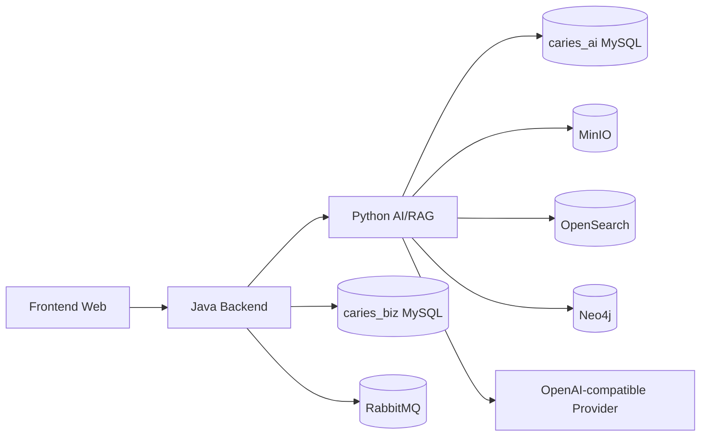
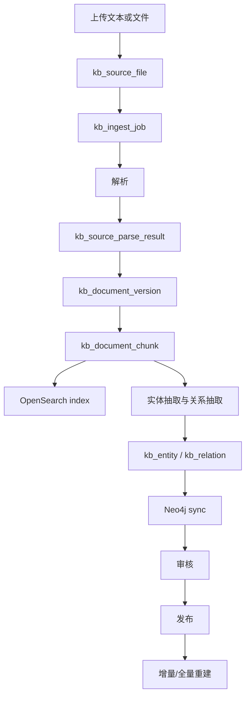

# 07 知识图库与 AI 全量实施方案

## 1. 建设目标与非目标

### 1.1 建设目标

1. 建设真实知识入库、审核、发布、回滚链路。
2. 建设词法检索、向量检索、图谱检索三路融合的 RAG 问答能力。
3. 建设 Java BFF 对前端统一暴露的知识治理与 RAG 调试后台。
4. 建设可追溯日志、评估闭环和可执行验收标准。

### 1.2 非目标

1. 不建设前端直连 Python 的问答页面。
2. 不建设绕过审核直接上线的知识导入流程。
3. 不将 `LOCAL_JSON`、`MOCK` 作为正式默认路径。
4. 不将 RAG 输出包装为最终诊断或处方建议。
5. 不在主文档中继续堆叠字段级细节，字段冻结统一放在附录。

## 2. 系统边界

| 边界 | 固定职责 |
| --- | --- |
| Frontend Web | 只调用 Java `/api/v1/kb/**` 与 `/api/v1/rag/**` |
| Java Backend | 鉴权、机构隔离、统一响应、BFF、错误屏蔽、对 Python 转发 |
| Python AI/RAG | 知识导入、解析、切块、OpenSearch、Neo4j、RAG 编排、评估、日志 |
| MySQL `caries_biz` | 业务主数据与权限 |
| MySQL `caries_ai` | 知识库、图谱、检索日志、评估日志 |
| MinIO | 原始知识文件与解析产物 |
| OpenSearch | `kb_doc_index` 与 `kb_chunk_index` |
| Neo4j | `Concept` / `AliasTerm` / `EvidenceDocument` / `EvidenceChunk` 图谱 |

## 3. 总体架构

### 3.1 系统部署图

### 3.2 知识入库链路图

### 3.3 RAG 检索编排图

```mermaid
flowchart TD
    Q[原始问题] --> RW[query rewrite]
    RW --> IC[intent classify]
    RW --> EL[entity linking]
    RW --> LEX[lexical retrieval]
    RW --> DEN[dense retrieval]
    EL --> GRA[graph retrieval]
    LEX --> FUS[fusion]
    DEN --> FUS
    GRA --> FUS
    FUS --> RR[rerank]
    RR --> RP{refusal policy}
    RP -->|拒答| OUT1[保守回答]
    RP -->|继续| GEN[LLM answer generation]
    GEN --> VAL[answer validator]
    VAL --> OUT2[answer + citations + safetyFlags + traceId]
```

## 4. 技术栈冻结

| 类别 | 主路径 | fallback | 禁止路径 |
| --- | --- | --- | --- |
| 前端 | Vue 3 + Vite + TypeScript + Element Plus | 无 | 前端直连 Python |
| Java | Spring Boot | 无 | 前端绕过 Java |
| Python | FastAPI | 无 | 直接写 `caries_biz` |
| 检索 | OpenSearch BM25 + dense vector | `LOCAL_JSON` 仅开发兜底 | 以 `LOCAL_JSON` 作为正式演示 |
| 图谱 | Neo4j | 无 | 仅做文档字符串拼接而无图谱留痕 |
| 模型网关 | OpenAI-compatible provider | Mock LLM 仅本地调试 | 生产默认 MOCK |

## 5. 知识分层

| 层级 | 来源 | 自动入图谱 | 自动进入检索 | 人工审核 | 发布条件 |
| --- | --- | --- | --- | --- | --- |
| 权威医学知识 | 指南、规范、标准教材 | 是 | 是 | 必须 | `review_status=APPROVED` 且 `publish_status=PUBLISHED` |
| 项目内部规则知识 | 业务规则、随访规则 | 是 | 是 | 必须 | 同上 |
| 患者解释模板 | 面向患者的解释模板 | 否 | 是 | 必须 | 同上 |
| 图谱实体关系知识 | 实体抽取与关系抽取结果 | 是 | 间接 | 必须 | `kb_graph_sync_log=SUCCESS` 且版本已发布 |
| 评估集知识 | `rag_eval_*` 数据集与问题集 | 否 | 否 | 必须 | 数据集激活且问题完整 |

## 6. 知识治理链路

| 步骤 | 输入 | 处理服务 | 输出 | 落库 | 失败策略 |
| --- | --- | --- | --- | --- | --- |
| 上传原始文件 | 文件流 / 文本 | `KnowledgeService.upload_document` / `import_document` | source file | `kb_source_file` | `parse_status=FAILED`，允许重试 |
| 解析 | 原始文件 | `DocumentParseService` | 规范化 Markdown 与结构化 JSON | `kb_source_parse_result` | 记录 `error_message` |
| 版本生成 | 解析结果 | `KnowledgeService._ingest_parsed_content` | 新版本 | `kb_document_version` | 保留旧版本，不覆盖写 |
| chunk 构建 | 规范化文本 | `ChunkBuildService` | 文本切片 | `kb_document_chunk` | 当前 job 失败 |
| 图谱抽取 | chunk | `EntityExtractionService` | 实体、关系、chunk refs | `kb_entity` / `kb_relation` | `kb_graph_sync_log=FAILED` |
| OpenSearch 写入 | chunk + embedding | `OpenSearchIndexService` | `kb_chunk_index` / `kb_doc_index` | OpenSearch | 允许 rebuild 补偿 |
| Neo4j 写入 | 实体、关系 | `GraphUpsertService` | 图谱节点与关系 | Neo4j | 先清理同文档图，再幂等重建 |
| 审核 | 指定版本 | `submit_review` / `approve` / `reject` | 审核结果 | `kb_review_record` | 未审核禁止发布 |
| 发布 | 审核通过版本 | `publish` | published 版本 | `kb_publish_record` | 一个文档同一时刻仅 1 个 published |
| 回滚 | 历史版本 | `rollback` | 新 publish record | `kb_publish_record` | 不允许静默回滚 |
| 全量重建 | 已发布版本 | `rebuild` | 重建报告 | `kb_rebuild_job` | 失败后保留旧索引与旧图谱 |

## 7. 三路检索默认规则

| 项目 | 默认值 | 来源 |
| --- | --- | --- |
| lexical topK | `20` | `CG_RAG_LEXICAL_TOP_K` |
| dense topK | `20` | `CG_RAG_DENSE_TOP_K` |
| graph topK | `10` | `CG_RAG_GRAPH_TOP_K` |
| fusion topK | `12` | `CG_RAG_FUSION_TOP_K` |
| rerank topK | `8` | `CG_RAG_RERANK_TOP_K` |
| final evidence | `6` | `CG_RAG_ANSWER_EVIDENCE_TOP_K` |
| 最低证据数 | `2` | `CG_RAG_EVIDENCE_MIN_COUNT` |
| 最低文档数 | `1` | `CG_RAG_EVIDENCE_MIN_DISTINCT_DOCS` |

融合规则固定为：

- 使用按通道加权的 RRF：`channel_weight / (60 + rank)`。
- 对文本证据额外叠加 `source_authority_score * 0.05` 与 `freshness_score * 0.03`。
- 对图谱证据额外叠加 `graph_confidence_score * CG_RAG_GRAPH_CONFIDENCE_WEIGHT`。

## 8. LLM 输出约束

RAG 输出必须保留：

- `answer`
- `answerText`
- `citations`
- `retrievedChunks`
- `graphEvidence`
- `safetyFlags`
- `confidence`
- `refusalReason`
- `traceId`

禁止事项：

1. 禁止输出最终诊断。
2. 禁止输出处方建议。
3. 证据不足时必须拒答或保守表达。
4. 无引用时必须带安全标记。

## 9. Java 与前端边界

### 9.1 前端可见接口

- `/api/v1/kb/**`
- `/api/v1/rag/**`

### 9.2 Java 对 Python 内部接口

- `/ai/v1/knowledge/**`
- `/ai/v1/rag/**`
- `/ai/v1/logs/**`
- `/ai/v1/eval/**`

### 9.3 固定规则

1. 前端只调用 Java。
2. Java 负责 `orgId`、`operatorId`、`reviewerId`、`traceId` 注入。
3. Python 只接受稳定 DTO；状态变化接口不再接收裸 `dict`。

## 10. 实施阶段

1. 文档冻结阶段：以 `07*` 文档冻结接口、表、状态、检索参数。
2. 基础设施阶段：校准 OpenSearch、Neo4j、MinIO、MySQL、RabbitMQ。
3. 知识治理阶段：打通上传、解析、审核、发布、回滚。
4. 检索图谱阶段：稳定三路检索、融合、重排、拒答。
5. BFF 与前端阶段：统一 `/api/v1/kb/**` 与 `/api/v1/rag/**`。
6. 评估验收阶段：运行 `rag_eval_*`，输出指标与缺陷清单。

## 11. 验收总要求

1. 任一新增知识版本都能完整经历导入、审核、发布、回滚。
2. OpenSearch 与 Neo4j 可由附录 C 直接初始化。
3. RAG 请求日志能追溯到 retrieval、fusion、rerank、llm 调用。
4. 前端不存在对 Python 的直接依赖。
5. 回答输出始终带 `traceId`、`citations`、`safetyFlags`。

附录索引：

- 数据字典与状态码：`07A_数据字典与状态码规范.md`
- API 契约：`07B_API契约与DTO规范.md`
- OpenSearch / Neo4j：`07C_OpenSearch与Neo4j检索规范.md`
- 状态机与任务编排：`07D_任务编排_状态机_导入发布链规范.md`
- 测试与验收：`07E_测试矩阵_验收标准_双轨计划.md`
