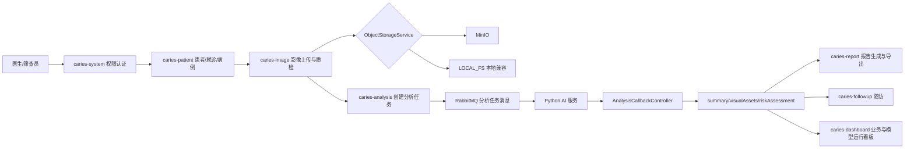
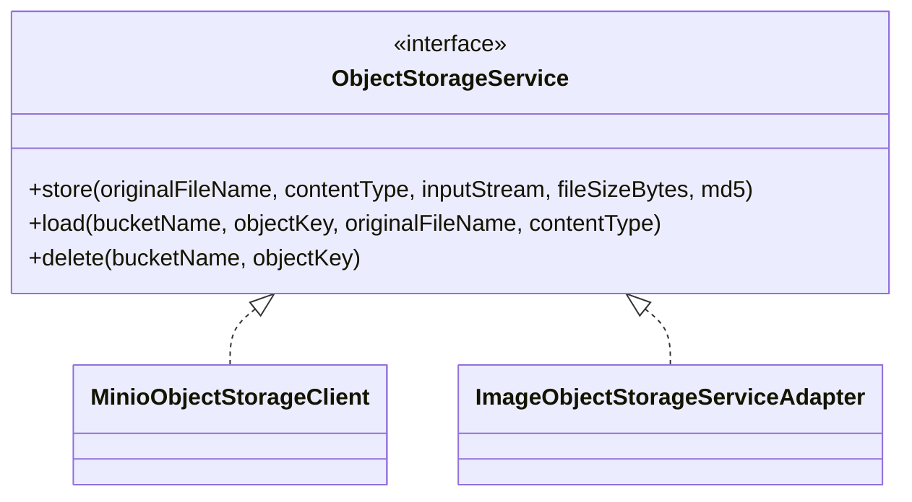

# 系统架构概述

更新日期：2026-04-15

本文档只描述当前代码已经落地的后端系统现状，并明确保留的设计边界。当前项目是 Java 后端业务平台，包含 AI 分析任务编排、影像对象存储、报告、随访、看板、系统权限等能力。Python AI 服务与前端不在本仓库内完整实现，本文档只写 Java 侧接口契约和对接要求。

## 1. 总体结论

1. 业务平台后端已经形成从患者、就诊、病例、影像、AI 分析、医生修正、报告、随访、看板、审计权限的闭环。
2. 对象存储现在保留并实现了 MinIO：默认 provider 为 `MINIO`，实现类为 `MinioObjectStorageClient`。
3. 本地文件系统不再作为当前运行口径：不再保留 LOCAL_FS 作为当前运行口径，测试中通过 mock/stub 隔离真实对象存储。
4. `Risk` 不作为独立业务模块存在，风险评估能力由 `med_risk_assessment_record`、`caries-analysis` 和 `caries-dashboard` 共同承载。
5. `ModelAdmin` 的完整模型治理平台没有独立模块，但 V014 已补入最小治理落点：`ana_model_version_registry`、任务 `model_version`、看板模型运行统计、回调 `traceId` 与 `inferenceMillis`。
6. Java/Python 回调契约已经冻结为 `AiAnalysisResultCallbackCommand`，当前接口对象固定为该 Command。
7. 报告导出不再只是审计日志，`ReportExportResultVO` 现在返回 `attachmentId`、`downloadUrl`、`expireAt`，同时仍记录 `rpt_export_log`。
8. 系统权限种子已经由 Flyway V014 补齐基础菜单、业务角色和数据权限规则，不再是“只能稳定演示管理员”的状态。

## 2. 当前模块清单

| 模块 | 当前职责 | 关键类 |
| --- | --- | --- |
| `caries-boot` | Spring Boot 启动、profile 配置、Flyway 迁移入口 | `CariesGuardApplication`、`application-local.yml`、`application-e2e.yml` |
| `caries-common` | 通用响应、异常、分页、工具 | `ApiResponse`、`BusinessException`、`PageResultVO` |
| `caries-framework` | 安全上下文、权限注解、操作日志、Trace | `RequirePermission`、`SecurityContextUtils`、`TraceIdUtils` |
| `caries-system` | 登录、用户、角色、菜单、字典、配置、数据权限规则 | `AuthController`、`SystemAdminController`、`SystemDataPermissionRuleAppService` |
| `caries-patient` | 患者、就诊、病例、诊断、牙位记录、病例状态机 | `PatientController`、`VisitController`、`CaseController` |
| `caries-image` | 附件上传、访问 URL、内容下载、病例影像、影像质检、对象存储 | `AttachmentAppService`、`MinioObjectStorageClient`、`ImageObjectStorageServiceAdapter` |
| `caries-analysis` | AI 分析任务、RabbitMQ 事件、Python 回调、结果摘要、视觉资产、风险记录、修正反馈 | `AnalysisTaskAppService`、`AnalysisCallbackAppService`、`AnalysisCallbackDomainService` |
| `caries-report` | 报告模板、报告生成、PDF 二进制生成、报告导出与下载 URL | `ReportAppService`、`ReportPdfService`、`ReportTemplateAppService` |
| `caries-followup` | 随访计划、随访任务、随访记录、通知记录 | `FollowupPlanAppService`、`FollowupTaskAppService`、`FollowupRecordAppService` |
| `caries-dashboard` | 业务统计、风险统计、待办、趋势、AI 运行质量统计 | `DashboardController`、`DashboardOpsController`、`DashboardStatsRepository` |
| `caries-integration` | 外部集成占位与依赖边界 | 当前无独立业务闭环 |

## 3. 部署与运行边界

当前代码确认的部署单元：

| 单元 | 当前状态 | 说明 |
| --- | --- | --- |
| Java 后端 | 已实现 | `caries-boot` 启动全部业务模块 |
| MySQL | 已实现 | Flyway V001-V017 管理结构和种子 |
| RabbitMQ | 已接入 | `RabbitAnalysisTaskEventPublisher` 发布 AI 分析任务消息 |
| MinIO | 已实现并默认启用 | `caries.storage.provider=MINIO`，`MinioObjectStorageClient` 负责对象读写 |
| 本地文件系统 | 已保留 | `provider-code=LOCAL_FS`，用于 e2e 和本地兼容 |
| Python AI 服务 | 仓库外实现 | Java 只提供消息 DTO 与回调 API 契约 |
| 前端 | 仓库外实现 | Java 提供 REST API、菜单、权限与下载 URL |
| 模型管理平台 | 未独立实现 | 仅保留最小治理表和统计口径 |

`application-local.yml` 当前对象存储关键配置：

```yaml
caries:
  storage:
    provider: ${CARIES_STORAGE_PROVIDER:MINIO}
    endpoint: ${CARIES_MINIO_ENDPOINT:http://127.0.0.1:9000}
    access-key: ${CARIES_MINIO_ACCESS_KEY:minioadmin}
    secret-key: ${CARIES_MINIO_SECRET_KEY:minioadmin}
    secure: ${CARIES_MINIO_SECURE:false}
    default-presign-expire-seconds: ${CARIES_STORAGE_PRESIGN_EXPIRE_SECONDS:900}
    auto-create-buckets: ${CARIES_STORAGE_AUTO_CREATE_BUCKETS:true}
    proxy-access-secret: ${CARIES_IMAGE_ACCESS_SECRET:change-me-to-a-strong-image-access-secret}
    buckets:
      image: ${CARIES_BUCKET_IMAGE:caries-image}
      visual: ${CARIES_BUCKET_VISUAL:caries-visual}
      report: ${CARIES_BUCKET_REPORT:caries-report}
      export: ${CARIES_BUCKET_EXPORT:caries-export}
```

## 4. 主链路架构



核心状态闭环：

1. `pat_patient` 创建患者。
2. `med_visit` 记录就诊。
3. `med_case` 创建病例，初始为 `CREATED`。
4. `med_attachment` 与 `med_image_file` 存储影像元数据，二进制文件进入 MinIO 或 LOCAL_FS。
5. `med_image_quality_check` 保存影像质检结果。
6. `ana_task_record` 创建 AI 分析任务，病例进入 `ANALYZING`。
7. Java 发送 `AiAnalysisRequestDTO`，其中包含 `accessUrl`、`accessExpireAt`、`storageProviderCode`、`attachmentMd5`，LOCAL_FS 场景可带 `localStoragePath`。
8. Python 回调 `AiAnalysisResultCallbackCommand`。
9. Java 写入 `ana_result_summary`、`ana_visual_asset`、`med_risk_assessment_record`，更新病例到 `REVIEW_PENDING` 或回退 `QC_PENDING`。
10. 医生通过 `ana_correction_feedback` 提交修正，字段支持训练候选和脱敏导出治理。
11. `rpt_record` 生成报告，PDF 附件进入对象存储。
12. `rpt_export_log` 记录导出审计，接口返回下载 URL。
13. `fup_plan`、`fup_task`、`fup_record` 承接随访。
14. `caries-dashboard` 聚合病例、风险、随访、模型运行质量指标。

## 5. AI 分析架构

当前 AI 侧不是直接调用 Java 内存对象，而是通过消息与回调进行解耦。

### 5.1 Java 发给 Python 的请求 DTO

类名：`AiAnalysisRequestDTO`

字段：

| 字段 | 说明 |
| --- | --- |
| `taskNo` | 分析任务编号 |
| `taskTypeCode` | 任务类型 |
| `caseId` | 病例 ID |
| `patientId` | 患者 ID |
| `orgId` | 机构 ID |
| `modelVersion` | Java 请求使用的模型版本 |
| `images` | 影像列表 |
| `patientProfile` | 患者画像，当前包含年龄、性别 |

`ImageItem` 字段：

| 字段 | 说明 |
| --- | --- |
| `imageId` | 影像记录 ID |
| `attachmentId` | 附件 ID |
| `imageTypeCode` | 影像类型 |
| `bucketName` | 对象存储 bucket |
| `objectKey` | 对象 key |
| `storageProviderCode` | `MINIO` 或 `LOCAL_FS` |
| `attachmentMd5` | 附件 MD5 |
| `accessUrl` | Java 生成的短时 HTTP 访问 URL |
| `accessExpireAt` | URL 过期时间，秒级时间戳 |
| `localStoragePath` | LOCAL_FS 场景可用，本地路径只用于受控环境 |

### 5.2 Python 回调 DTO

类名：`AiAnalysisResultCallbackCommand`

字段：

| 字段 | 说明 |
| --- | --- |
| `taskNo` | 任务编号，必填 |
| `taskStatusCode` | `PROCESSING`、`SUCCESS`、`FAILED` 等 |
| `startedAt` | 推理开始时间 |
| `completedAt` | 推理完成时间 |
| `modelVersion` | 实际执行模型版本 |
| `summary` | 摘要结构，包含 `overallHighestSeverity`、`uncertaintyScore`、`reviewSuggestedFlag`、`teethCount` |
| `rawResultJson` | 原始模型结果 JSON |
| `visualAssets` | 热力图、mask、overlay 等可视化资产 |
| `riskAssessment` | 风险等级与建议 |
| `errorMessage` | 失败原因 |
| `traceId` | Python 服务链路追踪 ID |
| `inferenceMillis` | 推理耗时毫秒 |
| `uncertaintyScore` | 顶层不确定性分，summary 中已有时可保持一致 |

## 6. 存储架构



对象存储结论：

1. `MINIO` 是当前默认 provider，并且代码已经实现。
2. `LOCAL_FS` 是兼容 provider，不再被写成唯一真实落地方案。
3. `AttachmentAppService.createAccessUrl` 面向用户端生成 MinIO presigned URL。
4. `AttachmentAppService.createInternalAccessUrl` 面向 Java/Python 内部联调生成 MinIO presigned URL。
5. `AttachmentAppService.resolveLocalStoragePath` 只服务 LOCAL_FS 场景，MinIO 场景不依赖共享卷。
6. `/api/v1/files/{attachmentId}/content` 仅作为受控代理兜底入口，根据签名参数读取对象内容。

## 7. 风险能力边界

当前不存在独立 `caries-risk` 模块，也没有独立 `RiskController`。风险评估能力落在：

| 承载点 | 说明 |
| --- | --- |
| `med_risk_assessment_record` | 风险等级、说明、建议、下次随访建议等结构化记录 |
| `AnalysisCallbackDomainService` | 处理 AI 回调中的 `riskAssessment` |
| `DashboardRiskStatsAppService` | 风险分布统计 |
| `ReportAppService` | 报告生成时引用风险与分析结果 |
| `FollowupPlanAppService` | 高风险病例可驱动随访计划 |

后续如果扩展风险能力，优先在 `caries-analysis` 或 `caries-dashboard` 内增加聚合查询，不建议仅为了图形完整拆出独立 `caries-risk`。

## 8. 模型治理边界

来源设计中的 ModelAdmin 理念保留，但当前不是独立模块。当前已经落地的最小治理能力：

| 能力 | 当前实现 |
| --- | --- |
| 模型版本登记 | `ana_model_version_registry` |
| 当前任务模型版本 | `ana_task_record.model_version` |
| 回调模型版本 | `AiAnalysisResultCallbackCommand.modelVersion` 写回任务 |
| 推理耗时 | `ana_task_record.inference_millis` |
| Trace 追踪 | `ana_task_record.trace_id` |
| 看板模型运行质量 | `/api/v1/dashboard/model-runtime` |
| 修正反馈训练准入 | `ana_correction_feedback.training_candidate_flag` 等字段 |

未落地内容：

1. 没有独立 `caries-model-admin` 模块。
2. 没有模型包上传、灰度发布、在线审批 UI。
3. 没有独立训练数据快照平台。
4. 没有标注平台源码。

## 9. 报告与下载架构

报告模块当前实现：

1. `ReportAppService.generateReport` 根据病例、患者、分析摘要、风险记录、模板生成报告。
2. `ReportPdfService.generatePdf` 使用 PDFBox 生成 PDF，支持中文字体候选加载；若运行环境无中文字体，会降级为 Helvetica 并将不可编码字符替换为 `?`。
3. PDF 作为附件写入 `med_attachment`，报告记录写入 `rpt_record`。
4. `ReportAppService.exportReport` 写入 `rpt_export_log`，同时通过 `AttachmentAppService.createAccessUrl` 返回 `downloadUrl` 与 `expireAt`。
5. 前端或外部消费者下载时调用 `/api/v1/files/{attachmentId}/access-url` 获取 MinIO presigned URL；`/content` 仅作为受控代理兜底入口保留。

## 10. 权限与数据治理架构

已实现内容：

1. `RequirePermission` 注解保护业务接口。
2. `sys_user`、`sys_role`、`sys_menu`、`sys_role_menu` 承载账号、角色、菜单与权限点。
3. V014 初始化 `ORG_ADMIN`、`DOCTOR`、`SCREENER` 三类业务角色。
4. V014 初始化患者、就诊、病例、影像、分析任务、报告、随访、看板、AI 运行看板菜单。
5. `sys_data_permission_rule` 已补入 ORG、SELF 范围和敏感列 masking policy 种子。
6. 业务模块目前仍以 `org_id` 校验为主，后续可以继续把 `ALL/ORG/DEPT/SELF/CUSTOM` 下推到更多 QueryAppService 与 Repository。

## 11. 当前不应再保留的旧表述

1. 不再写“来源使用 MinIO，但现状只有 ImageObjectStorageServiceAdapter”。现状是 MinIO 已保留并实现，LocalFS 为兼容 provider。
2. 回调契约统一写 `AiAnalysisResultCallbackCommand`。
3. 不再写“报告导出接口只是写日志”。现状是审计加下载 URL。
4. 不再写“菜单种子为空、只能管理员演示”。现状是 V014 已补菜单、角色和权限规则种子。
5. 不再把 `Risk` 和 `ModelAdmin` 画成已经独立实现的业务模块。
