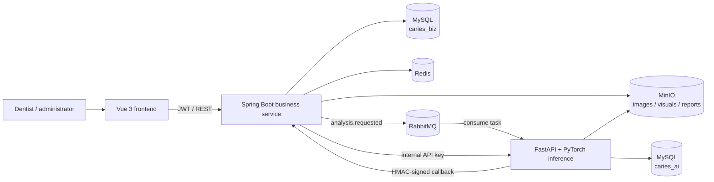
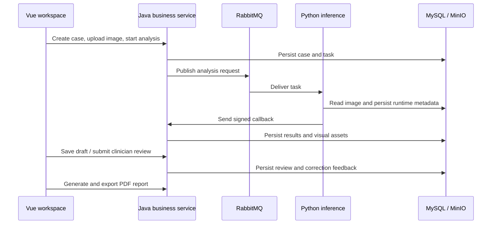

<div align="center">

# 🦷 CariesGuard

### AI-assisted dental imaging and clinician review platform

An end-to-end research system for patient intake, image analysis, clinician review, versioned reports, and follow-up care.


[中文文档](./README.md) · [Quick start](#-quick-start) · [Architecture](#-architecture) · [Model boundaries](#-models-and-inference-boundaries) · [Development](#-local-development)

</div>

> [!IMPORTANT]
> CariesGuard is a research and educational system, not a medical device. Its model output, risk hints, and automated grading must not replace examination, diagnosis, or treatment decisions made by a qualified dental professional.

---

## Contents

- [Overview](#-overview)
- [Implemented capabilities](#-implemented-capabilities)
- [Architecture](#-architecture)
- [Core workflow](#-core-workflow)
- [Models and inference boundaries](#-models-and-inference-boundaries)
- [Technology stack](#-technology-stack)
- [Repository layout](#-repository-layout)
- [Quick start](#-quick-start)
- [Configuration](#-configuration)
- [Local development](#-local-development)
- [API overview](#-api-overview)
- [Data and security](#-data-and-security)
- [Tests and quality checks](#-tests-and-quality-checks)
- [Model training and evaluation](#-model-training-and-evaluation)
- [Troubleshooting](#-troubleshooting)
- [Known limitations](#-known-limitations)

## ✨ Overview

CariesGuard uses a layered architecture consisting of a Vue clinical workspace, a Java business service, and a Python inference service. Java owns trusted business state such as identities, permissions, patients, cases, task status, reviews, reports, and follow-up records. Python loads inference assets, processes dental images, and records AI runtime metadata. RabbitMQ connects the asynchronous analysis workflow, while MinIO stores source images, generated visualizations, and PDF reports.

The repository has one primary full-stack runtime: the root `docker-compose.yml`. Legacy demo modes, mock inference, standalone segmentation launch paths, and the retired RAG runtime have been removed.

### Current implementation status

| Capability | Status | Source / notes |
| --- | :---: | --- |
| Authentication, JWT, roles, and data scopes | ✅ | Java + MySQL with organization-level isolation |
| Patient creation, search, and reuse | ✅ | Existing patients can be selected to prevent duplicates |
| Visits, cases, and dental image management | ✅ | Metadata in MySQL; files in MinIO |
| Asynchronous AI analysis | ✅ | Java publishes tasks; Python consumes and signs callbacks |
| Lesion segmentation | ✅ | Released DC1000 UNet TorchScript checkpoint |
| Dental disease object detection | ✅ | Released DENTEX YOLOv8n training artifact |
| Persistent clinician review drafts | ✅ | Drafts survive navigation and later sessions |
| Review submission and correction feedback | ✅ | Submitted decisions become traceable feedback records |
| Report versions, PDF generation, and export | ✅ | Real backend APIs and private MinIO objects |
| Follow-up plans, tasks, and records | ✅ | Persisted Java business workflow |
| Operational dashboard | ✅ | Aggregated from business tables, without fabricated UI data |
| Model provenance in the UI | ✅ | Distinguishes trained models, rules, and derived uncertainty |
| Quality, tooth candidates, grading, and risk | ⚠️ | Explicit heuristic stages, not represented as trained models |
| Qwen Vision enrichment | Optional | Disabled by default; requires a compatible endpoint and key |

## 🧩 Implemented capabilities

### Clinical workspace

- Patient search, patient reuse, and new patient registration.
- Visit and case creation, image upload, and controlled case transitions.
- Analysis task creation, retry, progress tracking, and result queries.
- Coordinated viewing of source images, lesion masks, overlays, and heatmaps.
- Autosaved clinician review drafts, final submission, and correction tracking.
- Versioned report generation, report history, and PDF export.
- Follow-up plan, task, and contact record management.
- Case, risk, backlog, and trend dashboards backed by persisted data.

### Platform capabilities

- JWT authentication, role permissions, and organization-scoped access.
- Password reset with a local development code or SMTP delivery.
- Flyway migrations for the business database and Alembic for AI metadata.
- HMAC-signed Python-to-Java callbacks with replay-window validation.
- Internal API-key protection for Java-to-Python synchronous requests.
- RabbitMQ failure routing so unsuccessful jobs are not silently lost.
- Private MinIO buckets, short-lived access URLs, and lifecycle policies.
- Startup validation for model manifests, checksums, implementation types, and readiness.

## 🏗 Architecture



### Service responsibilities

| Service | Responsibility | Default address |
| --- | --- | --- |
| `frontend` | UI, routing, interaction, and result visualization | <http://127.0.0.1:5173> |
| `backend-java` | Business rules, authorization, orchestration, reports, follow-up | <http://127.0.0.1:8080> |
| `backend-python` | Model inference, segmentation API, MQ worker, callbacks | <http://127.0.0.1:8001> |
| `mysql` | Persistent `caries_biz` and `caries_ai` data | `127.0.0.1:13306` |
| `redis` | Cache and supporting infrastructure | `127.0.0.1:16379` |
| `rabbitmq` | Analysis events and failure routing | `127.0.0.1:5672` |
| RabbitMQ management | Exchange and queue administration | <http://127.0.0.1:15672> |
| `minio` | Private object storage API | <http://127.0.0.1:9000> |
| MinIO console | Object storage administration | <http://127.0.0.1:9001> |

## 🔄 Core workflow

1. A clinician signs in, searches for an existing patient, or creates a patient.
2. The clinician creates a visit and case, then uploads dental images. MinIO stores bytes and Java stores file metadata.
3. Java persists an analysis task and publishes an `analysis.requested` event to RabbitMQ.
4. Python downloads the images and runs quality checks, tooth candidate localization, disease detection, lesion segmentation, grading, and risk assessment.
5. Python records AI runtime metadata and sends an HMAC-signed result callback to Java.
6. Java validates the callback, applies idempotency rules, persists structured results and visual attachments, and advances task state.
7. Low confidence, model errors, quality warnings, or disease-model evidence can request clinician review. Draft edits are persisted.
8. Final review creates correction feedback. The clinician can then generate a versioned PDF report and a follow-up plan.



## 🧠 Models and inference boundaries

Every analysis result exposes the implementation source for each stage. A `HEURISTIC` stage must not be described as a trained deep-learning model.

| Stage | Current implementation | Type | Purpose |
| --- | --- | --- | --- |
| Image quality | Brightness, contrast, sharpness, and related rules | `HEURISTIC` | Basic quality gating |
| Tooth candidate localization | Image-structure heuristics | `HEURISTIC` | Does not claim a tooth-location checkpoint |
| Dental disease detection | DENTEX YOLOv8n | `ML_MODEL` | Detects `Impacted`, `Caries`, `Periapical_Lesion`, `Deep_Caries` |
| Lesion segmentation | DC1000 UNet TorchScript | `ML_MODEL` | Produces a binary lesion mask and visual assets |
| Lesion grading | Rule composition | `HEURISTIC` | Not a validated grading classifier |
| Uncertainty | Softmax margin and rule composition | Derived | Requests review; not a separate diagnostic model |
| Risk assessment | Lesion and business-feature rules | `HEURISTIC` | Assistance for prioritization only |

### Released segmentation model

- Model code: `dc1000-unet-v1`
- Artifact format: TorchScript
- Input: single-channel `512 × 512`
- Output: binary `CARIES_LESION` mask
- Best training epoch: 22
- Validation Dice: `0.5404`
- Official test Dice: `0.6516`
- Manifest: `backend-python/assets/models/manifests/segmentation_v1.yaml`
- Checkpoint: `backend-python/assets/models/checkpoints/segmentation_v1/model.pt`

### Released disease detector

- Model code: `dentex-disease-detect-yolov8n-v1`
- Dataset: DENTEX quadrant-enumeration-disease
- Input size: `960`
- mAP@0.50: `0.5922`
- mAP@0.50:0.95: `0.4042`
- Mean precision: `0.6028`
- Mean recall: `0.5781`
- Checkpoint: `artifacts/training/dentex_detection/dentex_yolov8n_v1/weights/best.pt`
- Metadata: `artifacts/training/dentex_detection/dentex_yolov8n_v1/cariesguard_model_metadata.json`

### What `model-weights/` contains

The root `model-weights/` directory is active and must be retained. Docker mounts it read-only at `/app/model-weights`, the quality adapter reads `quality/quality_model_params.json`, and model-governance metadata refers to this runtime asset directory.

Despite its name, the current quality file contains rule/linear scoring parameters. It is intentionally reported as `HEURISTIC`; it is not evidence of a clinically validated neural model.

> [!WARNING]
> The metrics above are offline experimental results recorded by repository artifacts, not clinical validation. DC1000 is research data with binary lesion masks. DENTEX uses an image-level split because patient identifiers are unavailable, and its official validation set has no public ground truth. These limitations must accompany any presentation of model performance.

## 🛠 Technology stack

### Frontend

- Vue 3.5, TypeScript 6, Vite 8
- Pinia, Vue Router, Vue I18n
- Naive UI, Tailwind CSS, ECharts
- Axios and Lucide Icons

### Java service

- Java 17 and Spring Boot 3.2
- Spring Security, JWT, and Bean Validation
- MyBatis-Plus and Flyway
- RabbitMQ, Redis, and MinIO
- Apache PDFBox and Springdoc OpenAPI

### Python service

- Python 3.11, FastAPI, and Uvicorn
- PyTorch 2.5, Torchvision, and Ultralytics
- ONNX Runtime, OpenCV, Pillow, and pydicom
- SQLAlchemy, Alembic, and PyMySQL
- Pika and the MinIO SDK

### Infrastructure

- MySQL 8.4
- Redis 7
- RabbitMQ 3.13 Management
- MinIO
- Docker Compose

## 📁 Repository layout

```text
caries_guard/
├─ frontend/                 # Vue clinical workspace
├─ backend-java/             # Multi-module Spring Boot service
│  ├─ caries-common/         # Shared response and error types
│  ├─ caries-framework/      # Security context and infrastructure
│  ├─ caries-system/         # Users, roles, menus, configuration
│  ├─ caries-integration/    # MQ, object storage, integration support
│  ├─ caries-patient/        # Patients, visits, cases
│  ├─ caries-image/          # Images and attachments
│  ├─ caries-analysis/       # Analysis, review, feedback, governance
│  ├─ caries-report/         # Templates, versions, PDF reports
│  ├─ caries-followup/       # Follow-up plans, tasks, records
│  ├─ caries-dashboard/      # Persisted business metrics
│  └─ caries-boot/           # Application entrypoint and Flyway
├─ backend-python/           # FastAPI, MQ worker, inference pipeline
│  ├─ app/                   # APIs, services, repositories, adapters
│  ├─ assets/                # Released models, manifests, configuration
│  ├─ migrations/            # caries_ai Alembic migration chain
│  ├─ training/              # Data preparation, training, evaluation
│  └─ tests/                 # Python tests
├─ artifacts/training/       # Auditable training outputs and metrics
├─ model-weights/            # Active runtime rule/linear parameters
├─ data/                     # Raw and processed research data
├─ infra/                    # Infrastructure initialization
├─ scripts/                  # Health and data-maintenance scripts
├─ docker-compose.yml        # Primary full-stack orchestration
└─ .env.docker.example       # Docker environment template
```

## 🚀 Quick start

### 1. Requirements

- Docker Desktop with Docker Compose v2.
- At least 16 GB of system memory is recommended.
- The full Compose file declares `gpus: all` for Python, so it requires an NVIDIA GPU, working drivers, and Docker GPU support.
- Docker Desktop with the WSL2 backend is recommended on Windows.

### 2. Create local configuration

From the repository root:

```powershell
Copy-Item .env.docker.example .env
```

At minimum, replace these development defaults before the first shared deployment:

```dotenv
CARIES_MYSQL_PASSWORD=replace-with-a-strong-password
CARIES_MINIO_ACCESS_KEY=replace-with-an-access-key
CARIES_MINIO_SECRET_KEY=replace-with-a-strong-secret
CARIES_IMAGE_ACCESS_SECRET=replace-with-a-random-secret
CARIES_ANALYSIS_CALLBACK_SECRET=replace-with-a-random-secret
CARIES_INTERNAL_API_KEY=replace-with-a-random-secret
```

The credentials in `.env.docker.example` are intended only for local development.

### 3. Start the stack

```powershell
docker compose up -d --build
powershell -NoProfile -ExecutionPolicy Bypass -File .\scripts\wait-for-health.ps1
```

The initial build installs Java, Node.js, and Python dependencies and may take several minutes.

### 4. Sign in

Open <http://127.0.0.1:5173>.

| Field | Development default |
| --- | --- |
| Username | `admin` |
| Password | `123456` |

Change the default password after signing in. Seed migrations also create demonstration clinician accounts, but the administrator account is the recommended starting point for creating controlled test users.

### 5. Inspect health

```powershell
docker compose ps
docker compose logs -f backend-java backend-python

Invoke-RestMethod http://127.0.0.1:8080/actuator/health
Invoke-RestMethod http://127.0.0.1:8001/ai/v1/health
Invoke-WebRequest http://127.0.0.1:5173/health
```

### 6. Stop the stack

Preserve MySQL and MinIO volumes:

```powershell
docker compose down
```

Run `docker compose down -v` only when you intentionally want to erase all local persistent data.

## ⚙️ Configuration

See [`.env.docker.example`](./.env.docker.example) for the complete template.

### Ports

| Variable | Default | Purpose |
| --- | ---: | --- |
| `CARIES_FRONTEND_HOST_PORT` | `5173` | Frontend |
| `CARIES_BACKEND_JAVA_HOST_PORT` | `8080` | Java API |
| `CARIES_BACKEND_PYTHON_HOST_PORT` | `8001` | Python internal API |
| `CARIES_MYSQL_HOST_PORT` | `13306` | MySQL |
| `CARIES_REDIS_HOST_PORT` | `16379` | Redis |
| `CARIES_RABBIT_HOST_PORT` | `5672` | RabbitMQ AMQP |
| `CARIES_RABBIT_MGMT_HOST_PORT` | `15672` | RabbitMQ management |
| `CARIES_MINIO_HOST_PORT` | `9000` | MinIO API |
| `CARIES_MINIO_CONSOLE_HOST_PORT` | `9001` | MinIO console |

### Inference

| Variable | Default | Purpose |
| --- | --- | --- |
| `CG_MODEL_DEVICE` | `cuda:0` | PyTorch / YOLO device |
| `CG_MODEL_CONFIDENCE_THRESHOLD` | `0.5` | General confidence threshold |
| `CG_MODEL_DISEASE_DETECT_CONFIDENCE_THRESHOLD` | `0.25` | DENTEX detection threshold |
| `CG_UNCERTAINTY_REVIEW_THRESHOLD` | `0.35` | Uncertainty threshold for review |
| `CG_LOCAL_SEGMENTATION_ASSET_TTL_SECONDS` | `3600` | Temporary segmentation asset lifetime |
| `CG_QWEN_VISION_ENABLED` | `false` | Optional vision-model enrichment |

### Object retention

| Bucket | Default name | Policy |
| --- | --- | --- |
| Source images | `caries-image` | Private, no automatic expiry |
| Segmentation visuals | `caries-visual` | Private, expires after 30 days by default |
| PDF reports | `caries-report` | Private, no automatic expiry |
| Training exports | `caries-export` | Private, expires after 7 days by default |

## 💻 Local development

### Start infrastructure only

```powershell
docker compose up -d mysql mysql-init redis rabbitmq minio minio-init
```

### Java

JDK 17 and Maven 3.9+ are required. Local defaults match the host ports exposed by Compose.

```powershell
Set-Location backend-java
mvn -pl caries-boot -am spring-boot:run
```

The connection can be overridden with `CARIES_MYSQL_HOST`, `CARIES_MYSQL_PORT`, `CARIES_MYSQL_DATABASE`, `CARIES_MYSQL_USERNAME`, and `CARIES_MYSQL_PASSWORD`.

### Python

```powershell
Set-Location backend-python
python -m venv .venv
.\.venv\Scripts\Activate.ps1
python -m pip install -r requirements.txt

$env:CG_MYSQL_HOST = '127.0.0.1'
$env:CG_MYSQL_PORT = '13306'
$env:CG_RABBIT_HOST = '127.0.0.1'
$env:CG_MINIO_ENDPOINT = 'http://127.0.0.1:9000'
$env:CG_JAVA_CALLBACK_URL = 'http://127.0.0.1:8080/api/v1/internal/ai/callbacks/analysis-result'
$env:CG_ANALYSIS_CALLBACK_SECRET = 'change-me-to-a-strong-analysis-callback-secret'
$env:CG_INTERNAL_API_KEY = 'change-me-to-a-strong-internal-api-key'
$env:CG_MODEL_DEVICE = 'cpu'
$env:CG_LOCAL_SEGMENTATION_API_ENABLED = 'true'

python -m app.main
```

Java and Python must use matching callback secrets and internal API keys. CPU mode is appropriate for functional debugging but is substantially slower than GPU inference.

### Frontend

Node.js 20+ and npm are required. Vite proxies `/api` to `http://localhost:8080`.

```powershell
Set-Location frontend
npm install
npm run dev
```

## 🔌 API overview

Java OpenAPI UI: <http://127.0.0.1:8080/swagger-ui.html>

### Java business APIs

| Domain | Representative endpoints |
| --- | --- |
| Authentication | `POST /api/v1/auth/login`, `GET /api/v1/auth/me` |
| Patients | `GET/POST /api/v1/patients`, `GET/PUT /api/v1/patients/{patientId}` |
| Visits | `GET/POST /api/v1/visits` |
| Cases | `GET/POST /api/v1/cases`, `POST /api/v1/cases/{caseId}/status-transition` |
| Analysis | `POST /api/v1/analysis/tasks`, `GET /api/v1/analysis/tasks/{taskId}` |
| Segmentation proxy | `POST /api/v1/segmentation`, `GET /api/v1/segmentation/health` |
| Review | `GET /api/v1/review/queue`, `PUT .../draft`, `POST .../submit` |
| Reports | `POST /api/v1/cases/{caseId}/reports`, `GET /api/v1/reports`, `POST .../export` |
| Follow-up | `/api/v1/cases/{caseId}/followup/*`, `/api/v1/followup/*` |
| Dashboard | `/api/v1/dashboard/overview`, `/trend`, `/risk-level-distribution` |

Business APIs use a common response envelope. Except for login, health endpoints, and explicitly allowed signed callbacks, requests require valid authentication.

### Python internal APIs

| Method and path | Purpose |
| --- | --- |
| `GET /ai/v1/health` | Public service health check |
| `GET /ai/v1/segment/health` | Segmentation readiness |
| `POST /ai/v1/segment` | Synchronous lesion segmentation |
| `POST /ai/v1/analyze` | Full analysis pipeline |
| `POST /ai/v1/quality-check` | Image quality assessment |
| `POST /ai/v1/assess-risk` | Rule-based risk assessment |
| `GET /ai/v1/model-version` | Model and implementation provenance |

The browser does not call Python directly. It calls Java, which checks authorization and attaches the internal API key when proxying an eligible request.

## 🔐 Data and security

### Databases

- `caries_biz` stores identities, permissions, patients, cases, image metadata, analysis results, review drafts, reports, and follow-up records.
- `caries_ai` stores inference jobs, runtime model information, and callback audit metadata.
- Java uses Flyway migrations `V001` through `V005`; Python uses its existing Alembic chain.
- Historical migrations still contain early experimental table definitions so deployed databases can continue to upgrade safely. Their retired APIs, runtime services, bootstrap code, and scripts are no longer active.

### Security controls

- Java APIs use JWT authentication and role/permission checks.
- Non-administrator queries are filtered by organization across clinical domains.
- Python callbacks use a shared secret, timestamp window, and HMAC signature.
- Java uses a separate internal API key when calling Python.
- MinIO buckets deny anonymous access; files are returned through controlled APIs or short-lived signed URLs.
- Secrets are injected through environment variables and real values must never be committed.

### Production checklist

- Replace all `change-me`, `guest`, `minioadmin`, `1234`, and default administrator credentials.
- Terminate HTTPS at a trusted reverse proxy; do not expose Python, MySQL, Redis, RabbitMQ, or MinIO directly.
- Set `CARIES_PASSWORD_RESET_DEV_CODE_ENABLED=false`.
- Configure SMTP delivery using `PASSWORD_RESET_SMTP_SETUP.md`.
- Establish database and object-storage backups, restore drills, auditing, and key rotation.
- Define image, report, and log retention according to applicable policy.

## ✅ Tests and quality checks

### Java

```powershell
Set-Location backend-java
mvn test
```

The suite covers domain logic, authorization boundaries, end-to-end workflows, signed callbacks, persisted review drafts, review submission, and report semantics.

### Python

```powershell
Set-Location backend-python
.\.venv\Scripts\python.exe -m compileall -q app
.\.venv\Scripts\python.exe -m pytest -q
```

### Frontend

```powershell
Set-Location frontend
npm run typecheck
npm run build
```

### Compose

```powershell
docker compose config --quiet
```

Standard tests do not retrain large models. Runtime assets are instead protected through manifests, checksums, startup validation, and dedicated smoke scripts.

## 🧪 Model training and evaluation

Training utilities live in `backend-python/training/scripts/`.

| Script | Purpose |
| --- | --- |
| `prepare_dc1000_segmentation.py` | Prepare binary DC1000 segmentation data |
| `audit_segmentation_dataset.py` | Audit data integrity and label distribution |
| `train_dc1000_unet.py` | Train the DC1000 UNet |
| `evaluate_dc1000_unet.py` | Evaluate and record metrics |
| `export_dc1000_unet_torchscript.py` | Export the runtime TorchScript artifact |
| `train_dentex_detection.py` | Train the DENTEX YOLOv8 disease detector |
| `prepare_children_dental_external.py` | Prepare external pediatric dental data |
| `evaluate_segmentation.py` / `evaluate_grading.py` | General evaluation entrypoints |

Training data should not be published without authorization. `scripts/package-training-data.ps1` packages controlled training material, while `scripts/prepare-dentex-yolo.ps1` prepares the DENTEX YOLO layout.

When releasing a new model, update all of the following:

1. The checkpoint and SHA-256 checksum.
2. The manifest, class order, and input/output contract.
3. Dataset split methodology, metrics, and limitations.
4. Docker mounts and runtime environment variables.
5. Model code and provenance displayed by the frontend.

## 🧯 Troubleshooting

### `backend-python` cannot start because no GPU is available

The full Compose stack currently targets NVIDIA GPU environments. Verify `nvidia-smi` and Docker Desktop / WSL2 GPU support. On a CPU-only machine, run Python through the local-development flow with `CG_MODEL_DEVICE=cpu`. Changing only that variable is not sufficient while Compose still declares `gpus: all`.

### A model file is missing or its checksum is invalid

Verify that these are real binary artifacts rather than Git LFS pointer files:

- `backend-python/assets/models/checkpoints/segmentation_v1/model.pt`
- `artifacts/training/dentex_detection/dentex_yolov8n_v1/weights/best.pt`

Compare the paths and checksums with the segmentation manifest and `cariesguard_model_metadata.json`. Strict Docker startup validation intentionally fails fast when required assets are incomplete.

### Analysis remains queued

Check, in order:

1. Whether the RabbitMQ requested queue has a consumer.
2. Whether Python loaded its assets and downloaded the source image.
3. Whether the Java and Python callback secrets match.
4. Whether MinIO credentials and bucket names match.
5. Whether the RabbitMQ failed queue contains the task and error details.

### The frontend returns HTTP 401

Clear stale browser authentication state and sign in again. An expired JWT or a large system-clock difference may invalidate authentication.

### Local Java cannot connect to MySQL

Compose exposes MySQL on `13306` by default, and the local Java profile now uses that value. If you run a native MySQL server on `3306`, set `CARIES_MYSQL_PORT=3306`.

### Flyway validation fails after a migration was edited

Never edit a migration that has already been applied. Add a new higher-version migration. `CARIES_FLYWAY_CLEAN_DISABLED` is enabled by default, so the application will not erase a database to hide a validation problem.

## 🚧 Known limitations

- The project has not completed prospective clinical trials, multi-center external validation, or medical-device registration.
- The segmentation and detection datasets cover limited domains; different hardware, exposure, age groups, and acquisition protocols may cause distribution shift.
- Quality assessment, tooth candidate localization, grading, and risk remain heuristic implementations.
- Qwen Vision is optional and disabled by default; basic system availability does not depend on it.
- The full Docker Compose configuration currently targets an NVIDIA GPU. CPU debugging uses the local-development path.
- The repository does not currently declare one project-wide open-source license. Verify dataset, model, and dependency terms before redistribution.

---

<div align="center">

**CariesGuard — provenance for every automated result, clinician review for every clinical decision.**

Research use · Human in the loop · Traceable · Reproducible

</div>
