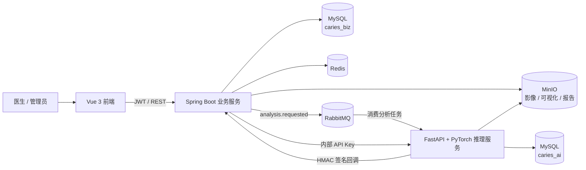
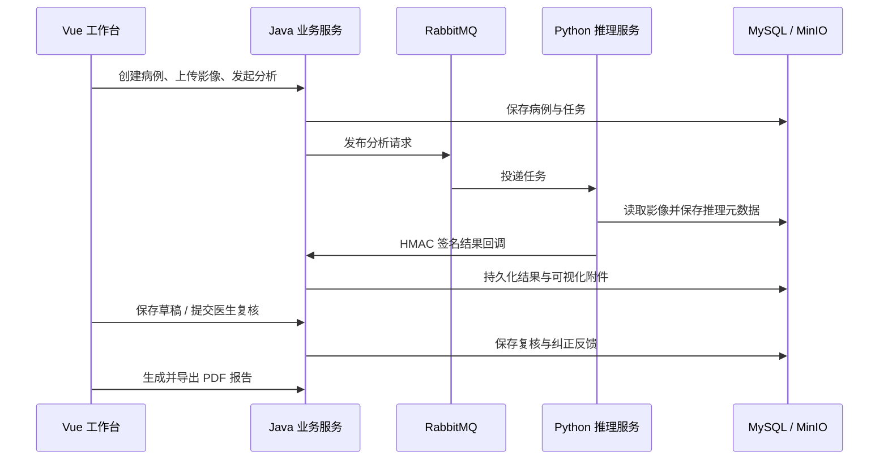

<div align="center">

# 🦷 CariesGuard

### 龋齿影像智能分析与医生复核平台

从患者建档、影像上传、异步推理，到医生复核、报告导出与随访管理的一体化研究系统。


[English](./README.en.md) · [快速开始](#-快速开始) · [系统架构](#-系统架构) · [模型说明](#-模型与推理边界) · [开发指南](#-本地开发)

</div>

> [!IMPORTANT]
> CariesGuard 是研究与教学用途的影像辅助分析系统，不是医疗器械。模型输出、风险提示和自动分级均不能替代口腔医生的检查、诊断与治疗决策。

---

## 📖 目录

- [项目概览](#-项目概览)
- [已实现能力](#-已实现能力)
- [系统架构](#-系统架构)
- [核心业务流程](#-核心业务流程)
- [模型与推理边界](#-模型与推理边界)
- [技术栈](#-技术栈)
- [目录结构](#-目录结构)
- [快速开始](#-快速开始)
- [配置说明](#-配置说明)
- [本地开发](#-本地开发)
- [接口速览](#-接口速览)
- [数据与安全](#-数据与安全)
- [测试与质量检查](#-测试与质量检查)
- [模型训练与评估](#-模型训练与评估)
- [常见问题](#-常见问题)
- [当前边界](#-当前边界)

## ✨ 项目概览

CariesGuard 采用“前端工作台 + Java 业务中台 + Python 推理服务”的分层架构。Java 服务负责用户、患者、病例、权限、任务状态、报告和随访等可信业务数据；Python 服务负责模型加载、影像推理和推理过程元数据；RabbitMQ 串联异步分析流程，MinIO 保存原始影像、可视化结果与 PDF 报告。

项目当前保留一条明确的正式运行路径：根目录 `docker-compose.yml`。旧的演示模式、Mock 推理和独立分割启动脚本均已移除；当前内置一个可替换存储实现的最小 RAG 运行时。

### 当前实现状态

| 能力 | 状态 | 数据来源 / 说明 |
| --- | :---: | --- |
| 登录、JWT、角色与数据权限 | ✅ | Java + MySQL，按组织隔离业务数据 |
| 患者建档、搜索与复用 | ✅ | 支持按患者信息检索，避免重复建档 |
| 就诊、病例与口腔影像管理 | ✅ | MySQL 保存元数据，MinIO 保存文件 |
| 异步 AI 分析 | ✅ | Java 发布任务，Python 消费并回调结果 |
| 病灶分割 | ✅ | 已发布 DC1000 UNet TorchScript 权重 |
| 牙体疾病目标检测 | ✅ | 已发布 DENTEX YOLOv8n 训练产物 |
| 医生复核草稿 | ✅ | 草稿持久化，可退出后继续编辑 |
| 复核提交与纠正反馈 | ✅ | 提交后生成可追踪的纠正反馈记录 |
| 报告版本、PDF 生成与导出 | ✅ | 后端真实接口与 MinIO 私有对象 |
| 随访计划、任务与记录 | ✅ | Java 业务接口持久化 |
| 运营仪表盘 | ✅ | 从真实业务表聚合，不使用前端假数据 |
| 模型来源展示 | ✅ | 页面区分真实模型、规则和不确定性来源 |
| 知识增强解释与诊疗建议 | ✅ MVP | 本地版本化知识库检索；可选 Qwen 生成；结果包含引用与知识版本 |
| 影像质量、牙位候选、分级、风险 | ⚠️ | 当前为启发式规则，不宣称为训练模型 |
| Qwen Vision 补充分析 | 可选 | 默认关闭，需要单独配置兼容服务和密钥 |

## 🧩 已实现能力

### 医生工作台

- 患者搜索、历史患者复用、新患者建档。
- 就诊与病例创建、影像上传、病例状态流转。
- 分析任务创建、失败重试、进度和结果查询。
- 原图、病灶掩膜、叠加图和热力图联合查看。
- 医生复核草稿自动保存、复核结论提交、修改记录追踪。
- 报告生成、历史版本查看、PDF 导出。
- 随访计划、随访任务和随访记录管理。
- 真实数据驱动的病例、风险、积压和趋势仪表盘。

### 平台能力

- JWT 身份认证、角色权限、组织数据范围控制。
- 密码重置流程；本地开发可返回验证码，生产可接 SMTP。
- Flyway 与 Alembic 分别管理业务库和 AI 元数据库迁移。
- HMAC 签名保护 Python → Java 分析结果回调。
- 内部 API Key 保护 Java → Python 同步推理接口。
- RabbitMQ 失败路由与失败队列，避免异常任务静默丢失。
- MinIO 私有桶、短时访问链接与对象生命周期策略。
- 模型清单、校验和、实现类型和运行状态的启动期校验。

## 🏗 系统架构



### 服务职责

| 服务 | 主要职责 | 默认地址 |
| --- | --- | --- |
| `frontend` | 页面、交互、权限路由、结果可视化 | <http://127.0.0.1:5173> |
| `backend-java` | 核心业务、鉴权、任务编排、报告、随访 | <http://127.0.0.1:8080> |
| `backend-python` | 模型推理、分割 API、MQ 消费与回调 | <http://127.0.0.1:8001> |
| `mysql` | `caries_biz` 与 `caries_ai` 数据持久化 | `127.0.0.1:13306` |
| `redis` | 缓存和基础设施能力 | `127.0.0.1:16379` |
| `rabbitmq` | 异步推理消息与失败路由 | `127.0.0.1:5672` |
| `rabbitmq` 管理台 | 队列与交换机管理 | <http://127.0.0.1:15672> |
| `minio` | 私有对象存储 API | <http://127.0.0.1:9000> |
| `minio` 控制台 | 对象存储管理 | <http://127.0.0.1:9001> |

## 🔄 核心业务流程

1. 医生登录系统，搜索并复用已有患者，或创建新患者。
2. 创建就诊和病例，上传口腔影像；文件进入 MinIO，元数据进入业务库。
3. Java 创建分析任务并向 RabbitMQ 发布 `analysis.requested` 消息。
4. Python 消费任务、下载影像并依次执行质量检查、候选定位、疾病检测、病灶分割、分级和风险评估。
5. Python 保存 AI 运行记录，并通过带时间戳和 HMAC 签名的接口回调 Java。
6. Java 校验回调、幂等写入结构化结果和可视化附件，更新病例与任务状态。
7. 低置信度、模型异常或疾病检测证据可触发医生复核；复核草稿会持久保存。
8. 医生提交复核后生成纠正反馈，随后可生成版本化 PDF 报告并创建随访计划。



## 🧠 模型与推理边界

系统会在接口结果和前端页面中展示每个阶段的实现来源。请不要把 `HEURISTIC` 阶段描述为“已训练深度学习模型”。

| 推理阶段 | 当前实现 | 类型 | 说明 |
| --- | --- | --- | --- |
| 影像质量检查 | 亮度、对比度、清晰度等规则 | `HEURISTIC` | 用于基础质量拦截 |
| 牙位候选定位 | 图像结构启发式定位 | `HEURISTIC` | 不伪装为牙位检测权重 |
| 牙体疾病检测 | DENTEX YOLOv8n | `ML_MODEL` | 检测 `Impacted`、`Caries`、`Periapical_Lesion`、`Deep_Caries` |
| 病灶分割 | DC1000 UNet TorchScript | `ML_MODEL` | 输出二值病灶掩膜及可视化图 |
| 病变分级 | 规则组合 | `HEURISTIC` | 不是已验证的分级分类器 |
| 不确定性 | Softmax margin / 规则组合 | 派生指标 | 用于提示复核，不是独立诊断模型 |
| 风险评估 | 病灶与业务特征规则 | `HEURISTIC` | 仅作辅助排序和提醒 |

### 已发布分割模型

- 模型代码：`dc1000-unet-v1`
- 格式：TorchScript
- 输入：单通道 `512 × 512`
- 输出：二值 `CARIES_LESION` 掩膜
- 最佳训练轮次：22
- 验证集 Dice：`0.5404`
- 官方测试集 Dice：`0.6516`
- 清单：`backend-python/assets/models/manifests/segmentation_v1.yaml`
- 权重：`backend-python/assets/models/checkpoints/segmentation_v1/model.pt`

### 已发布疾病检测模型

- 模型代码：`dentex-disease-detect-yolov8n-v1`
- 数据集：DENTEX quadrant-enumeration-disease
- 输入尺寸：`960`
- mAP@0.50：`0.5922`
- mAP@0.50:0.95：`0.4042`
- 平均 Precision：`0.6028`
- 平均 Recall：`0.5781`
- 权重：`artifacts/training/dentex_detection/dentex_yolov8n_v1/weights/best.pt`
- 元数据：`artifacts/training/dentex_detection/dentex_yolov8n_v1/cariesguard_model_metadata.json`

### `model-weights/` 是否仍在使用

根目录 `model-weights/` 是当前运行资产，必须保留。Docker 会将它只读挂载到 `/app/model-weights`，质量检查适配器会读取 `quality/quality_model_params.json`，模型治理元数据也会引用这个目录。

需要特别说明：当前质量参数文件保存的是规则与线性评分参数，因此系统仍将该阶段标记为 `HEURISTIC`；文件夹名称中包含 `weights`，并不代表它是经过临床验证的神经网络权重。

> [!WARNING]
> 上述数值是仓库内训练产物记录的离线实验结果，不等于临床验证。DC1000 是研究数据且标签为二值病灶掩膜；DENTEX 数据因没有公开患者标识而使用图像级划分，官方验证集也没有公开真值。这些限制必须随任何结果说明一并保留。

## 🛠 技术栈

### 前端

- Vue 3.5、TypeScript 6、Vite 8
- Pinia、Vue Router、Vue I18n
- Naive UI、Tailwind CSS、ECharts
- Axios、Lucide Icons

### Java 业务服务

- Java 17、Spring Boot 3.2
- Spring Security、JWT、Bean Validation
- MyBatis-Plus、Flyway
- RabbitMQ、Redis、MinIO
- Apache PDFBox、Springdoc OpenAPI

### Python 推理服务

- Python 3.11、FastAPI、Uvicorn
- PyTorch 2.5、Torchvision、Ultralytics
- ONNX Runtime、OpenCV、Pillow、pydicom
- SQLAlchemy、Alembic、PyMySQL
- Pika、MinIO SDK

### 基础设施

- MySQL 8.4
- Redis 7
- RabbitMQ 3.13 Management
- MinIO
- Docker Compose

## 📁 目录结构

```text
caries_guard/
├─ frontend/                 # Vue 医生工作台
├─ backend-java/             # Spring Boot 多模块业务后端
│  ├─ caries-common/         # 通用返回、异常与基础类型
│  ├─ caries-framework/      # 安全、上下文和技术基础设施
│  ├─ caries-system/         # 用户、角色、菜单、配置
│  ├─ caries-integration/    # MQ、对象存储及跨模块集成
│  ├─ caries-patient/        # 患者、就诊、病例
│  ├─ caries-image/          # 影像与附件
│  ├─ caries-analysis/       # 分析、复核、反馈、模型治理
│  ├─ caries-report/         # 报告模板、版本和 PDF
│  ├─ caries-followup/       # 随访计划、任务和记录
│  ├─ caries-dashboard/      # 真实业务指标聚合
│  └─ caries-boot/           # 启动模块与 Flyway 迁移
├─ backend-python/           # FastAPI、MQ 消费者与推理管线
│  ├─ app/                   # API、服务、仓储和模型适配器
│  ├─ assets/                # 模型清单、配置与发布权重
│  ├─ migrations/            # caries_ai Alembic 迁移链
│  ├─ training/              # 数据准备、训练和评估脚本
│  └─ tests/                 # Python 自动化测试
├─ artifacts/training/       # 可审计的训练输出与指标
├─ model-weights/            # 运行时规则参数及附加权重
├─ data/                     # 原始 / 处理后研究数据目录
├─ infra/                    # MySQL 初始化等基础设施配置
├─ scripts/                  # 健康等待、数据打包等维护脚本
├─ docker-compose.yml        # 唯一完整运行编排
└─ .env.docker.example       # Docker 配置模板
```

## 🚀 快速开始

### 1. 环境要求

- Docker Desktop，支持 Docker Compose v2。
- 建议至少 16 GB 内存，并为 Docker 分配足够磁盘空间。
- 当前完整 Compose 为 Python 容器声明了 `gpus: all`，因此需要 NVIDIA GPU、可用驱动及 Docker GPU 支持。
- Windows 推荐 Docker Desktop + WSL2 后端。

### 2. 创建本地配置

在仓库根目录执行：

```powershell
Copy-Item .env.docker.example .env
```

首次启动前，请至少修改 `.env` 中以下值：

```dotenv
CARIES_MYSQL_PASSWORD=replace-with-a-strong-password
CARIES_MINIO_ACCESS_KEY=replace-with-an-access-key
CARIES_MINIO_SECRET_KEY=replace-with-a-strong-secret
CARIES_IMAGE_ACCESS_SECRET=replace-with-a-random-secret
CARIES_ANALYSIS_CALLBACK_SECRET=replace-with-a-random-secret
CARIES_INTERNAL_API_KEY=replace-with-a-random-secret
```

> `.env.docker.example` 中的密码只适合本机开发，不能直接用于共享环境或部署环境。

### 3. 启动完整服务

```powershell
docker compose up -d --build
powershell -NoProfile -ExecutionPolicy Bypass -File .\scripts\wait-for-health.ps1
```

第一次构建会安装 Java、Node.js 和 Python 依赖，耗时取决于网络与本地镜像缓存。

### 4. 登录

打开 <http://127.0.0.1:5173>：

| 项目 | 开发环境默认值 |
| --- | --- |
| 用户名 | `admin` |
| 密码 | `123456` |

登录后请及时修改默认密码。初始化脚本还会创建演示医生账户，但日常开发建议使用管理员账户创建和管理正式测试用户。

### 5. 查看运行状态

```powershell
docker compose ps
docker compose logs -f backend-java backend-python
```

常用健康检查：

```powershell
Invoke-RestMethod http://127.0.0.1:8080/actuator/health
Invoke-RestMethod http://127.0.0.1:8001/ai/v1/health
Invoke-WebRequest http://127.0.0.1:5173/health
```

### 6. 停止服务

保留 MySQL 和 MinIO 数据：

```powershell
docker compose down
```

仅当你明确要删除全部本地持久化数据时，才执行 `docker compose down -v`。

## ⚙️ 配置说明

完整可配置项见 [`.env.docker.example`](./.env.docker.example)。以下为最常用配置：

### 端口

| 环境变量 | 默认值 | 用途 |
| --- | ---: | --- |
| `CARIES_FRONTEND_HOST_PORT` | `5173` | 前端入口 |
| `CARIES_BACKEND_JAVA_HOST_PORT` | `8080` | Java API |
| `CARIES_BACKEND_PYTHON_HOST_PORT` | `8001` | Python 内部 API |
| `CARIES_MYSQL_HOST_PORT` | `13306` | MySQL |
| `CARIES_REDIS_HOST_PORT` | `16379` | Redis |
| `CARIES_RABBIT_HOST_PORT` | `5672` | RabbitMQ AMQP |
| `CARIES_RABBIT_MGMT_HOST_PORT` | `15672` | RabbitMQ 管理台 |
| `CARIES_MINIO_HOST_PORT` | `9000` | MinIO API |
| `CARIES_MINIO_CONSOLE_HOST_PORT` | `9001` | MinIO 控制台 |

### 推理

| 环境变量 | 默认值 | 说明 |
| --- | --- | --- |
| `CG_MODEL_DEVICE` | `cuda:0` | PyTorch / YOLO 设备 |
| `CG_MODEL_CONFIDENCE_THRESHOLD` | `0.5` | 通用置信度阈值 |
| `CG_MODEL_DISEASE_DETECT_CONFIDENCE_THRESHOLD` | `0.25` | DENTEX 检测阈值 |
| `CG_UNCERTAINTY_REVIEW_THRESHOLD` | `0.35` | 触发人工复核的不确定性阈值 |
| `CG_LOCAL_SEGMENTATION_ASSET_TTL_SECONDS` | `3600` | 临时分割资源有效期 |
| `CG_QWEN_VISION_ENABLED` | `false` | 是否启用可选视觉大模型 |

### 存储与保留策略

| 桶 | 默认名称 | 策略 |
| --- | --- | --- |
| 原始影像 | `caries-image` | 私有，无自动过期 |
| 分割可视化 | `caries-visual` | 私有，默认 30 天过期 |
| PDF 报告 | `caries-report` | 私有，无自动过期 |
| 训练数据导出 | `caries-export` | 私有，默认 7 天过期 |

## 💻 本地开发

### 只启动基础设施

希望在 IDE 中运行 Java、Python 和前端时，可先启动依赖服务：

```powershell
docker compose up -d mysql mysql-init redis rabbitmq minio minio-init
```

### Java

要求 JDK 17 和 Maven 3.9+。本地配置默认连接 Compose 暴露的 MySQL `13306`、Redis `16379`、RabbitMQ `5672` 和 MinIO `9000`。

```powershell
Set-Location backend-java
mvn -pl caries-boot -am spring-boot:run
```

可通过 `CARIES_MYSQL_HOST`、`CARIES_MYSQL_PORT`、`CARIES_MYSQL_DATABASE`、`CARIES_MYSQL_USERNAME` 和 `CARIES_MYSQL_PASSWORD` 覆盖数据库连接。

### Python

```powershell
Set-Location backend-python
python -m venv .venv
.\.venv\Scripts\Activate.ps1
python -m pip install -r requirements.txt

$env:CG_MYSQL_HOST = '127.0.0.1'
$env:CG_MYSQL_PORT = '13306'
$env:CG_RABBIT_HOST = '127.0.0.1'
$env:CG_MINIO_ENDPOINT = 'http://127.0.0.1:9000'
$env:CG_JAVA_CALLBACK_URL = 'http://127.0.0.1:8080/api/v1/internal/ai/callbacks/analysis-result'
$env:CG_ANALYSIS_CALLBACK_SECRET = 'change-me-to-a-strong-analysis-callback-secret'
$env:CG_INTERNAL_API_KEY = 'change-me-to-a-strong-internal-api-key'
$env:CG_MODEL_DEVICE = 'cpu'
$env:CG_LOCAL_SEGMENTATION_API_ENABLED = 'true'

python -m app.main
```

本地运行时，Java 与 Python 的回调密钥和内部 API Key 必须分别保持一致。CPU 可用于功能调试，但推理速度会明显低于 GPU。

### 前端

要求 Node.js 20+ 和 npm。Vite 会把 `/api` 代理到 `http://localhost:8080`。

```powershell
Set-Location frontend
npm install
npm run dev
```

## 🔌 接口速览

Java OpenAPI 文档：<http://127.0.0.1:8080/swagger-ui.html>

### Java 业务接口

| 领域 | 代表接口 |
| --- | --- |
| 登录与身份 | `POST /api/v1/auth/login`、`GET /api/v1/auth/me` |
| 患者 | `GET/POST /api/v1/patients`、`GET/PUT /api/v1/patients/{patientId}` |
| 就诊 | `GET/POST /api/v1/visits` |
| 病例 | `GET/POST /api/v1/cases`、`POST /api/v1/cases/{caseId}/status-transition` |
| 影像 | `/api/v1/cases/{caseId}/images` 与附件接口 |
| 分析 | `POST /api/v1/analysis/tasks`、`GET /api/v1/analysis/tasks/{taskId}` |
| 分割代理 | `POST /api/v1/segmentation`、`GET /api/v1/segmentation/health` |
| 复核 | `GET /api/v1/review/queue`、`PUT .../draft`、`POST .../submit` |
| 报告 | `POST /api/v1/cases/{caseId}/reports`、`GET /api/v1/reports`、`POST .../export` |
| 随访 | `/api/v1/cases/{caseId}/followup/*`、`/api/v1/followup/*` |
| 仪表盘 | `/api/v1/dashboard/overview`、`/trend`、`/risk-level-distribution` |

所有业务接口统一返回标准响应结构；除登录、健康检查及明确放行的内部回调外，均应携带有效身份凭证。

### Python 内部接口

| 方法与路径 | 用途 |
| --- | --- |
| `GET /ai/v1/health` | 健康检查，唯一无需内部 API Key 的入口 |
| `GET /ai/v1/segment/health` | 分割模型状态 |
| `POST /ai/v1/segment` | 同步病灶分割 |
| `POST /ai/v1/analyze` | 完整分析管线 |
| `POST /ai/v1/quality-check` | 影像质量检查 |
| `POST /ai/v1/assess-risk` | 风险规则评估 |
| `GET /ai/v1/model-version` | 模型与实现来源信息 |
| `GET /ai/v1/knowledge/status` | 知识库版本、文档数及运行状态 |
| `POST /ai/v1/knowledge/search` | 调试知识检索结果 |
| `POST /ai/v1/knowledge/reload` | 修改知识文件后热加载 |

### 最小 RAG 配置

默认知识文件为 `backend-python/knowledge-base/caries_guidance_v1.json`，当前知识版本为 `caries-guidance-2026.09.15-v2-pdf`。知识条目取自仓库根目录的 ICDAS、ICCMS 和国家卫生健康委 PDF，仅选取分级、活动性、风险、管理和修复原则相关页段；每条 citation 会返回 `sourceFile` 和 `sourcePages`。C0-C3 是本项目根据 ICCMS 影像深度建立的辅助风险分层，不是 ICDAS/ICCMS 官方编码。

本地检索和结构化模板生成默认启用，不依赖外部大模型；分析结果会写入 `knowledgeVersion`、`citations`、`evidenceRefs`、`clinicalSummary` 和 `treatmentPlan`。修改知识文件后可重建 Python 镜像，或调用知识库重载接口。

若要使用 Qwen 对检索证据进行受约束生成，在 `.env` 中配置：

```dotenv
CG_RAG_LLM_ENABLED=true
CG_RAG_LLM_MODEL=qwen3-vl-plus
CG_RAG_LLM_BASE_URL=https://dashscope.aliyuncs.com/compatible-mode/v1
CG_RAG_LLM_API_KEY=替换为真实密钥
```

外部生成失败时会自动降级到检索模板，不影响影像分析主任务。知识内容属于辅助决策资料，正式使用前应由口腔专业人员审核来源、适用人群、版本和建议文本。

浏览器不直接调用 Python 服务。前端统一访问 Java，由 Java 完成权限校验并携带 `CG_INTERNAL_API_KEY` 代理需要的请求。

## 🔐 数据与安全

### 数据库

- `caries_biz`：用户、权限、患者、病例、影像元数据、分析结果、复核草稿、报告和随访。
- `caries_ai`：推理任务、模型运行和回调审计等 AI 元数据。
- Java 使用 Flyway `V001`～`V005`；Python 使用 Alembic 管理既有迁移链。
- 历史迁移中仍包含早期实验表定义，用于保障已部署数据库可继续升级；对应的废弃运行时、接口和脚本已从当前系统移除。

### 安全控制

- Java API 使用 JWT 和角色 / 权限注解控制访问。
- 非管理员用户的患者、病例、影像、分析、报告和随访查询按组织范围过滤。
- Python 回调使用共享密钥、时间戳和 HMAC 校验，并设置允许的时钟偏差。
- Java 访问 Python 内部 API 时使用独立 API Key。
- MinIO 桶默认禁止匿名访问，文件通过受控接口或短时签名链接获取。
- 密码、数据库凭据、存储密钥和 API Key 只通过环境变量注入，不应提交真实值。

### 生产部署前检查

- 替换所有 `change-me`、`guest`、`minioadmin`、`1234` 和默认管理员密码。
- 使用 HTTPS 和可信反向代理，不直接暴露 Python、MySQL、Redis、RabbitMQ 或 MinIO API。
- 关闭本地验证码回显：`CARIES_PASSWORD_RESET_DEV_CODE_ENABLED=false`。
- 将密码重置交付模式切换到 SMTP，并参考 `PASSWORD_RESET_SMTP_SETUP.md`。
- 为数据库和对象存储配置备份、恢复演练、访问审计与密钥轮换。
- 根据机构合规要求设置影像、报告和日志的保留周期。

## ✅ 测试与质量检查

### Java

```powershell
Set-Location backend-java
mvn test
```

测试覆盖领域服务、权限边界、主链路集成、分析回调、医生复核草稿持久化、复核提交与报告语义。

### Python

```powershell
Set-Location backend-python
.\.venv\Scripts\python.exe -m compileall -q app
.\.venv\Scripts\python.exe -m pytest -q
```

### 前端

```powershell
Set-Location frontend
npm test
npm run typecheck
npm run build
```

### Compose 配置

```powershell
docker compose config --quiet
```

也可以从仓库根目录执行统一质量门禁：

```powershell
powershell -NoProfile -ExecutionPolicy Bypass -File .\scripts\run-engineering-gates.ps1
```

`.github/workflows/ci.yml` 会在 push 和 pull request 上执行同类检查。模型文件较大，普通单元测试不会重新训练模型；模型可加载性由清单、校验和、启动校验和专用冒烟脚本共同保证。

### 性能与可靠性验证

- `scripts/load-test.py`：输出吞吐量、错误率及 p50/p95/p99，并按阈值返回退出码。
- `scripts/fault-drill.ps1`：暂停 AI 工作进程，验证 Java 隔离性，然后恢复并验证健康状态。
- `deploy/k8s/`：提供应用层多副本、滚动更新、探针、PDB 和 HPA 模板；有状态中间件使用外部集群服务。
- Java Actuator 暴露受保护的 Prometheus 指标；前端 Nginx 对 API 设置单 IP 请求与连接限制。
- RabbitMQ 队列类型可通过 `CARIES_ANALYSIS_QUEUE_TYPE=quorum` 同步切换 Java 与 Python 为 quorum queue；现有本地 classic queue 保持兼容。切换已有队列前必须先制定迁移方案，RabbitMQ 不允许原地改变队列类型。

验收指标、运行方式和不能越界的高可用声明见 [`docs/engineering-readiness.md`](./docs/engineering-readiness.md)。

## 🧪 模型训练与评估

训练脚本位于 `backend-python/training/scripts/`，主要入口包括：

| 脚本 | 用途 |
| --- | --- |
| `prepare_dc1000_segmentation.py` | 准备 DC1000 二值分割数据 |
| `audit_segmentation_dataset.py` | 审计数据完整性与标注分布 |
| `train_dc1000_unet.py` | 训练 DC1000 UNet |
| `evaluate_dc1000_unet.py` | 评估并输出指标 |
| `export_dc1000_unet_torchscript.py` | 导出运行时 TorchScript |
| `train_dentex_detection.py` | 训练 DENTEX YOLOv8 疾病检测器 |
| `prepare_children_dental_external.py` | 准备外部儿童牙科数据 |
| `evaluate_segmentation.py` / `evaluate_grading.py` | 通用评估入口 |

训练数据不应直接提交到公开仓库。可使用 `scripts/package-training-data.ps1` 打包受控训练资料，使用 `scripts/prepare-dentex-yolo.ps1` 构建 DENTEX YOLO 数据结构。发布新模型时必须同步更新：

1. 模型权重和 SHA-256 校验和。
2. 模型清单、类别顺序、输入输出约定。
3. 数据划分方式、指标与已知限制。
4. Docker 挂载路径和运行时环境变量。
5. 前端展示的模型代码与来源信息。

## 🧯 常见问题

### `backend-python` 因 GPU 启动失败

完整 Compose 当前要求 NVIDIA GPU。先确认 `nvidia-smi` 可用，并检查 Docker Desktop / WSL2 的 GPU 支持。只有 CPU 的环境可按“本地开发”章节运行 Python，并设置 `CG_MODEL_DEVICE=cpu`；不要只修改该变量后继续使用声明了 `gpus: all` 的完整 Compose。

### Python 报模型文件缺失或校验和不一致

确认以下文件存在且没有被 Git LFS 占位文件替代：

- `backend-python/assets/models/checkpoints/segmentation_v1/model.pt`
- `artifacts/training/dentex_detection/dentex_yolov8n_v1/weights/best.pt`

随后对照模型清单和 `cariesguard_model_metadata.json` 检查路径与摘要。Docker 环境默认启用严格启动校验，模型不完整时会直接失败，这是预期的安全行为。

### Java 能启动，但分析任务一直等待

依次检查：

1. RabbitMQ 的 requested queue 是否存在消费者。
2. Python 日志是否成功加载模型和下载源影像。
3. Java 与 Python 的 `CARIES_ANALYSIS_CALLBACK_SECRET` / `CG_ANALYSIS_CALLBACK_SECRET` 是否一致。
4. MinIO 桶名和凭据是否一致。
5. RabbitMQ 失败队列中是否出现任务及异常原因。

### 前端能打开，但接口返回 401

清除浏览器中过期登录状态并重新登录；同时确认系统时间正确。JWT 过期或本机时间偏差过大都可能导致鉴权失败。

### 本地 Java 无法连接 MySQL

Compose 暴露的默认端口是 `13306`。本地配置已默认使用该端口；若你使用本机 MySQL `3306`，请设置 `CARIES_MYSQL_PORT=3306`。

### 修改迁移文件后 Flyway 校验失败

不要修改已经应用到数据库的迁移。应新增更高版本迁移。`CARIES_FLYWAY_CLEAN_DISABLED` 默认开启，系统不会为了通过校验而自动清库。

## 🚧 当前边界

- 本项目尚未完成前瞻性临床试验、跨中心外部验证或医疗器械注册。
- 分割和检测模型的数据域有限，面对不同设备、曝光、年龄和成像协议时可能发生明显分布偏移。
- 质量检查、牙位候选、病变分级和风险评估仍为规则实现，需要新的标注数据和独立验证后才能替换为模型。
- Qwen Vision 是默认关闭的可选补充能力，不参与系统可用性的基本保证。
- 完整 Docker Compose 当前以 NVIDIA GPU 环境为目标；CPU 调试需采用本地开发方式。
- `deploy/k8s` 仅实现无状态应用层的扩缩容模板；数据库、消息队列、对象存储的集群、备份恢复和监控仍须由目标运行平台提供并完成演练。
- 仓库提供压测与故障演练工具，但未随代码宣称某个环境已经达到固定吞吐量或月度可用性；这些结论必须以目标环境的留档结果为准。
- 仓库目前未声明统一的开源许可证；在分发代码、模型或数据前，请先确认各数据集和第三方组件的授权条款。

---

<div align="center">

**CariesGuard — 让每一项自动分析都有来源，让每一次临床判断都保留人工复核。**

研究用途 · 医生在环 · 可追踪 · 可复现

</div>
