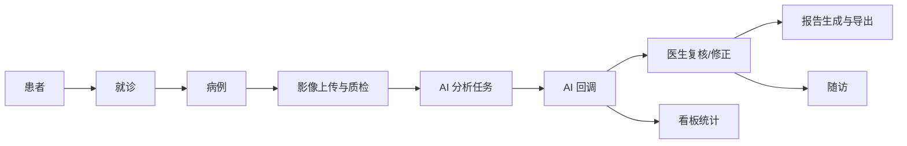

# 业务主链路与状态机说明

更新日期：2026-04-15

## 1. 主链路

## 2. 病例状态

主要状态来自字典 `med_case_status`：

| 状态 | 含义 |
| --- | --- |
| `CREATED` | 已创建 |
| `QC_PENDING` | 待影像质检 |
| `ANALYZING` | AI 分析中 |
| `REVIEW_PENDING` | 待医生复核 |
| `REPORT_READY` | 报告已就绪 |
| `FOLLOWUP_REQUIRED` | 需要随访 |
| `CLOSED` | 已关闭 |
| `CANCELLED` | 已取消 |

## 3. 影像链路

1. `FileController.upload` 上传文件。
2. `AttachmentAppService.upload` 计算 MD5、调用 `ObjectStorageService`、写 `med_attachment`。
3. local 默认 provider 为 `MINIO`，由 `MinioObjectStorageService` 写入 MinIO。
4. e2e provider 为 `LOCAL_FS`，由 `LocalObjectStorageService` 写入本地目录。
5. `CaseImageController.create` 建立 `med_image_file` 和病例关联。
6. `ImageQualityCheckController.save` 写入 `med_image_quality_check`。

## 4. AI 分析链路

1. 调用 `POST /api/v1/analysis/tasks` 或 `POST /api/v1/cases/{caseId}/analysis`。
2. `AnalysisTaskAppService` 创建 `ana_task_record`。
3. `AnalysisTaskAppService` 为每张图调用 `AttachmentAppService.createInternalAccessUrl`。
4. 发送 `AiAnalysisRequestDTO` 到 RabbitMQ。
5. Python 服务通过 `images[].accessUrl` 拉图。
6. Python 回调 `POST /api/v1/internal/ai/callbacks/analysis-result`。
7. `AnalysisCallbackAppService` 执行幂等判断。
8. `AnalysisCallbackDomainService` 写入 `ana_result_summary`、`ana_visual_asset`、`med_risk_assessment_record`。
9. 更新 `ana_task_record.model_version`、`trace_id`、`inference_millis`、状态和时间。
10. 成功后病例进入复核相关状态，失败时按规则回退到 `QC_PENDING`。

## 5. 回调幂等规则

1. 同一终态重复回调只 ACK，不重复写结果。
2. 重试任务发生后，旧任务晚到成功回调不能覆盖新任务链路。
3. `PROCESSING -> SUCCESS` 保留 `startedAt` 和 `completedAt`。
4. `FAILED` 回调保留 `errorMessage`。
5. `traceId` 和 `inferenceMillis` 用于后续排查和看板统计。

## 6. 修正反馈与训练候选

1. 医生通过 `CorrectionFeedbackController` 或病例别名接口提交修正。
2. `CorrectionFeedbackAppService` 写 `ana_correction_feedback`。
3. 当前默认写入训练准入字段：`training_candidate_flag`、`desensitized_export_flag`、`review_status_code`。
4. 后续训练导出应按审核状态、脱敏状态和快照编号筛选。

## 7. 报告链路

1. `ReportAppService.generateReport` 聚合病例、患者、分析摘要、风险记录和模板。
2. `ReportPdfService.generatePdf` 使用 PDFBox 生成 PDF。
3. 报告 PDF 写入对象存储并生成 `rpt_record`。
4. `ReportAppService.exportReport` 写入 `rpt_export_log`。
5. 导出返回 `ReportExportResultVO`，包含 `attachmentId`、`downloadUrl`、`expireAt`。

## 8. 随访链路

1. `FollowupPlanController` 创建随访计划。
2. `FollowupTaskController` 创建、分派、更新任务状态。
3. `FollowupRecordController` 记录随访结果。
4. 看板聚合随访任务摘要和待办。

## 9. 权限链路

1. `RequirePermission` 注解保护 API。
2. `sys_menu.permission_code` 定义权限点。
3. `sys_role_menu` 绑定角色和菜单。
4. V014 已提供业务角色和业务菜单种子。
5. `sys_data_permission_rule` 提供 ORG/SELF 范围和列脱敏策略。